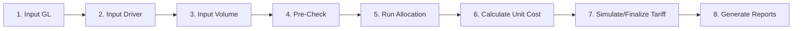

# Panduan Penggunaan WebApp KMKB
## Kurikulum Belajar & Petunjuk Teknis Terintegrasi

> **Versi:** Desember 2025  
> **Platform:** WebApp Costing, Tariff, dan Clinical Pathway Management System

---

## Daftar Isi

### Bagian A: Landasan Teori & Prinsip
1. [Prinsip Dasar Analisis Biaya (Defining the Final Product)](#bagian-a-prinsip-dasar-analisis-biaya)
2. [Defining Cost Centres (Mendefinisikan Pusat Biaya)](#defining-cost-centres-mendefinisikan-pusat-biaya)

### Bagian B: Modul Pembelajaran & Petunjuk Teknis
- [Modul 1-5: Dasar-Dasar Costing Rumah Sakit](#modul-1-5-dasar-dasar-costing-rumah-sakit)
- [Modul 6-8: Cost Allocation](#modul-6-8-cost-allocation)
- [Modul 9-10: Unit Costing](#modul-9-10-unit-costing)
- [Modul 11-13: Clinical Pathway](#modul-11-13-clinical-pathway)
- [Modul 14-21: Tariff Management](#modul-14-21-tariff-management)

### Bagian C: Referensi Operasional
- [Ikhtisar Peran & Menu](#ikhtisar-peran--menu)
- [Workflow Cepat End-to-End](#workflow-cepat-end-to-end)
- [Troubleshooting](#troubleshooting)
- [Lampiran & Template](#lampiran--template)

---

# BAGIAN A: PRINSIP DASAR ANALISIS BIAYA

## Defining the Final Product of Cost Analysis

Sebelum memulai proses costing, penting memahami prinsip-prinsip dasar dalam mendefinisikan "produk akhir" dari analisis biaya.

### A.1. Menentukan Layanan/Unit untuk Unit Cost

**Prinsip:** Tentukan apakah unit cost dihitung secara agregat (seluruh RS), per departemen, atau per bangsal.

**Faktor penentu:**
- **Tujuan analisis**: Perbandingan antar departemen → per departemen. Perbandingan antar RS → agregat.
- **Ketersediaan data**: Granular membutuhkan data detail di level tersebut.

**Implementasi di Webapp:**

| Fitur | Menu | Keterangan |
|-------|------|------------|
| Cost Centers hierarkis | Master Data → Cost Centers | Mendukung struktur parent-child |
| Tipe Cost Center | Master Data → Cost Centers | Pembedaan `revenue` vs `support` |
| Lokasi fisik | Master Data → Cost Centers | Field building, floor, division |
| Cost References | Master Data → Cost References | Layanan terhubung ke cost center |

**Rekomendasi:**
```
Perbandingan antar-RS       → 1 Cost Center agregat per jenis layanan
Perbandingan antar-bangsal  → Cost Center terpisah per bangsal (VIP, Kelas 1, ICU, dsb)
Analisis detail layanan     → Cost References yang terhubung ke Cost Center
```

---

### A.2. Final Product vs Intermediate Output

**Prinsip:** Lab dan Radiologi bisa sebagai:
- **Final product**: unit cost tersendiri
- **Intermediate**: dialokasikan ke rawat inap/jalan

**Status di Webapp:**

| Cost Center | Tipe | Perlakuan |
|-------------|------|-----------|
| IGD, Rawat Inap, Rawat Jalan | Revenue | Final product |
| Laboratorium, Radiologi, OK | Revenue | Final product (default) |
| Administrasi, Laundry, Kebersihan | Support | Intermediate → dialokasikan |

> **[!IMPORTANT]**
> Tetap konsisten dalam pemilihan final/intermediate sepanjang periode analisis. Dokumentasikan di Knowledge References.

> **[!NOTE] Catatan Pengembangan**
> Toggle otomatis final/intermediate belum tersedia. Perlu penyesuaian manual di Allocation Maps.

---

### A.3. Satuan Output untuk Final Cost Centre

| Jenis Layanan | Satuan Output | Fitur Sync di Webapp |
|---------------|---------------|----------------------|
| Rawat Inap | Inpatient-days atau Admissions | ✅ Via `Service Volume Current → Rawat Inap` |
| Rawat Jalan | Visits (kunjungan) | ✅ Via `Service Volume Current` |
| Laboratorium | Jumlah tes | ✅ Via `Service Volume Current → Laboratorium` |
| Radiologi | Jumlah pemeriksaan | ✅ Via `Service Volume Current → Radiologi` |
| Kamar Operasi | Jumlah operasi | ✅ Via `Service Volume Current → Bedah Sentral` |
| Farmasi | Jumlah resep/item | Manual / Import Excel |

**Formula:**
```
Unit Cost = (Direct Cost + Indirect Cost) / Service Volume
```

**Menu:**
1. **Input Data:** `GL & Expenses → Service Volumes` (Bisa import Excel atau Sync)
2. **Master Satuan:** `Master Data → Units of Measurement` (Gunakan satuan standar)

> **[!TIP]**
> - Sepakati di awal: rawat inap menggunakan `patient-days` atau `admissions`.
> - Gunakan fitur **Sync** di menu `Service Volume Current` untuk menarik data volume otomatis dari modul operasional tanpa input manual.
> - Pastikan satuan (Unit) yang digunakan di Cost References konsisten dengan Master UoM.

---

### A.4. Periode Data

| Tujuan | Periode |
|--------|---------|
| Monitoring internal cepat | Bulanan/Triwulan |
| Perbandingan antar RS | Tahunan (menghilangkan variasi musiman) |

**Default webapp:** Bulanan (`period_year`, `period_month`)

> **[!NOTE] Catatan Pengembangan**
> Agregasi triwulan/tahunan otomatis belum tersedia. Lakukan agregasi manual via Excel atau gunakan Reports → Unit Cost Summary untuk multi-periode.

---

## Defining Cost Centres (Mendefinisikan Pusat Biaya)

Langkah penting dalam menghitung unit cost adalah menentukan **cost centres** di rumah sakit, yaitu unit kegiatan tempat biaya langsung dan tidak langsung akan dibebankan.

### A.5. Apa itu Cost Centre?

**Cost Centre** adalah pusat aktivitas/unit kerja di mana biaya dialokasikan dan diukur.

**Jenis biaya yang dibebankan:**

| Kategori | Contoh | Keterangan |
|----------|--------|------------|
| **Biaya Langsung (Direct Costs)** | Gaji, bahan habis pakai, jasa, perjalanan, sewa | Dapat ditelusuri langsung ke cost centre |
| **Biaya Tidak Langsung (Indirect Costs)** | Depresiasi, alokasi dari departemen lain | Dialokasikan melalui cost allocation |

**Implementasi di Webapp:**
- Menu: `Master Data → Cost Centers`
- Setiap cost center memiliki: kode, nama, tipe, building, floor, division

---

### A.6. Mengapa Cost Centre Harus Selaras dengan Struktur Organisasi?

**Alasan manajerial:**
1. Rumah sakit **diorganisasi dalam departemen/unit kerja**
2. Cost centre yang selaras memberikan **"peta rute"** untuk menyalurkan biaya melalui proses cost-finding
3. Membantu manajer melihat **penggunaan sumber daya vs anggaran** dan layanan yang dihasilkan
4. Menjadi kerangka untuk menghitung biaya fungsi yang berbeda pada setiap unit

**Implementasi di Webapp:**

```
┌─────────────────────────────────────────────────────────────┐
│  STRUKTUR ORGANISASI RS    →    STRUKTUR COST CENTER        │
├─────────────────────────────────────────────────────────────┤
│  Direktorat Pelayanan      →    Revenue Centers             │
│  ├── IGD                   →    ├── IGD                     │
│  ├── Rawat Jalan           →    ├── Rawat Jalan             │
│  └── Rawat Inap            →    └── Rawat Inap per Bangsal  │
│                                                              │
│  Direktorat Penunjang      →    Intermediate Centers        │
│  ├── Laboratorium          →    ├── Lab Klinik              │
│  ├── Radiologi             →    ├── Radiologi               │
│  └── Farmasi               →    └── Farmasi                 │
│                                                              │
│  Direktorat Umum           →    Overhead/Support Centers    │
│  ├── Keuangan              →    ├── Keuangan                │
│  ├── SDM                   →    ├── SDM                     │
│  └── Umum                  →    └── Housekeeping, Laundry   │
└─────────────────────────────────────────────────────────────┘
```

> **[!TIP]**
> Gunakan field `division` di Cost Center untuk mengelompokkan sesuai struktur organisasi RS Anda.

---

### A.7. Klasifikasi Cost Centre

Secara administratif, cost centre dibedakan menurut **sifat pekerjaan** (Concept), namun di Webapp disederhanakan menjadi **Tipe** (System):

| Klasifikasi (Konsep) | Deskripsi | Contoh | Tipe di Webapp |
|----------------------|-----------|--------|----------------|
| **Patient Care** | Unit yang memberi layanan pasien secara langsung | Bangsal/rawat inap, Unit rawat jalan, IGD, OK | `revenue` |
| **Intermediate** | Layanan penunjang klinis, bisa menjadi *final product* atau dialokasikan lagi | Laboratorium, Farmasi, Radiologi | `revenue` |
| **Overhead** | Layanan dukungan umum (Non-Revenue) | Keuangan, Gizi, Keamanan, Housekeeping | `support` |

> **[!NOTE]**
> Di Webapp, **Intermediate** dan **Patient Care** sama-sama bertipe `revenue` karena keduanya memiliki **Cost References** (layanan yang bisa dihitung unit cost-nya dan dijual). Bedanya hanya pada alur pelayanan klinisnya.

**Alur biaya mengikuti step-down:**
```
Overhead (Support) → Intermediate (Revenue) → Patient Care (Revenue)
       └───────────────────────────────────────────┘
```

**Implementasi di Webapp:**
- Patient Care & Intermediate: set tipe `revenue` di Master Data → Cost Centers
- Overhead: set tipe `support` di Master Data → Cost Centers
- Alokasi diatur di: `Allocation → Allocation Maps`

---

### A.8. Berapa Banyak Cost Centre yang Perlu Dibuat?

**Prinsip:** Tingkat rincian cost centre ditentukan oleh **kebutuhan analisis**.

| Kebutuhan Analisis | Tingkat Rincian | Contoh |
|--------------------|-----------------|--------|
| Unit cost per bangsal | Setiap bangsal = 1 cost centre | VIP, Kelas 1, Kelas 2, Kelas 3, ICU, NICU |
| Unit cost per jenis penunjang | Setiap jenis = 1 cost centre | Lab Klinik, Lab PA, X-Ray, CT Scan, MRI |
| Analisis agregat | Gabungan = 1 cost centre | Rawat Inap (semua kelas), Penunjang Medis |

**Rekomendasi granularitas:**

| Tingkat | Kelebihan | Kekurangan |
|---------|-----------|------------|
| **Detail** | Analisis mendalam, benchmarking per unit | Butuh data lebih banyak, kompleks |
| **Agregat** | Lebih mudah, cukup untuk perbandingan antar RS | Kurang detail, tidak bisa lihat per unit |

> **[!IMPORTANT]**
> Keputusan granularitas harus diambil **di awal** dan tetap konsisten sepanjang periode analisis.

**Implementasi di Webapp:**
- Buat cost center sesuai tingkat rincian yang diperlukan
- Gunakan parent-child hierarchy jika perlu struktur bertingkat
- Dokumentasikan keputusan di Knowledge References

---

### A.9. Untuk Cost Centre Mana Unit Cost Dihitung?

**Tujuan utama:** Mengalokasikan semua biaya RS ke pusat-pusat yang akan diukur unit cost-nya.

| Target Utama | Contoh | Satuan Output |
|--------------|--------|---------------|
| **Patient Care Centres** | Bangsal maternitas, klinik rawat jalan, unit anak | Per admission, per patient-day, per visit |
| **Intermediate Departments** (jika perlu) | Laboratorium, Radiologi, Farmasi | Per tes, per pemeriksaan, per resep |
| **Overhead tertentu** (kasus khusus) | Gizi, Laundry | Per porsi, per kg linen |

**Kapan menghitung unit cost untuk overhead?**
- Untuk menilai opsi **outsourcing** (misal: kontrak catering vs gizi internal)
- Untuk **benchmarking** kinerja unit overhead antar RS
- Untuk **cost recovery analysis** layanan internal

**Implementasi di Webapp:**
- Unit cost dihitung untuk Cost References yang terhubung ke revenue cost center
- Menu: `Unit Costing → Calculate Unit Cost`

---

### A.10. Memisahkan Cost Centre Penghasil Pendapatan vs Non-Pendapatan

Untuk analisis **cost recovery** (sejauh mana tarif menutup biaya), perlu membedakan:

| Kategori | Deskripsi | Contoh | Perlakuan |
|----------|-----------|--------|-----------|
| **Revenue-Producing** | Menghasilkan pendapatan dari pasien | Patient care, Intermediate | Final cost centre (unit cost dihitung) |
| **Non-Revenue** | Tidak menghasilkan pendapatan langsung | Security, Housekeeping, Payroll | Biaya dialokasikan ke revenue-producing |

**Contoh tarif yang dapat dianalisis cost recovery-nya:**
- Biaya kamar, makan, keperawatan (tarif harian)
- Obat dan balutan
- X-ray, lab, fisioterapi

**Implementasi di Webapp:**
- Revenue-producing: Tipe `revenue` di Cost Centers
- Non-revenue: Tipe `support` di Cost Centers
- Semua biaya support dialokasikan ke revenue melalui step-down allocation

---

### A.11. Dua Versi Unit Cost: Dengan atau Tanpa Biaya Penunjang

Dalam analisis, Anda mungkin perlu menghitung **dua jenis unit cost**:

| Versi | Deskripsi | Kegunaan |
|-------|-----------|----------|
| **Termasuk biaya penunjang** | Unit cost mencakup alokasi biaya lab, radiologi, farmasi | Total cost per admission, cost recovery analysis |
| **Tidak termasuk biaya penunjang** | Unit cost hanya biaya langsung + overhead non-klinis | Analisis efisiensi unit, benchmarking per layanan |

**Contoh praktis:**

```
Biaya per admission rawat inap:
├── Versi 1 (dengan penunjang):  Rp 5.000.000
│   ├── Biaya langsung rawat inap:  Rp 2.500.000
│   ├── Overhead dialokasikan:      Rp 1.000.000
│   └── Penunjang (lab, rad):       Rp 1.500.000
│
└── Versi 2 (tanpa penunjang):   Rp 3.500.000
    ├── Biaya langsung rawat inap:  Rp 2.500.000
    └── Overhead dialokasikan:      Rp 1.000.000
```

> **[!NOTE] Catatan Pengembangan**
> Webapp saat ini menghitung unit cost dengan metode standar (termasuk alokasi overhead). Fitur dual-view reporting (dengan/tanpa biaya penunjang dialokasikan) direncanakan untuk pengembangan mendatang:
> - [ ] Toggle include/exclude intermediate allocation
> - [ ] Laporan perbandingan dua versi
> - [ ] Dashboard dual-view

**Workaround saat ini:**
1. Jalankan dua skenario Allocation Maps:
   - Skenario A: Lab/Radiologi sebagai final product (tidak dialokasikan)
   - Skenario B: Lab/Radiologi dialokasikan ke patient care
2. Hitung unit cost untuk masing-masing skenario
3. Dokumentasikan kedua hasil di Knowledge References

---

### Ringkasan Kesesuaian Webapp dengan Literatur

| Prinsip | Status | Catatan |
|---------|--------|---------|
| Cost center fleksibel | ✅ Tersedia | Hierarki, tipe, lokasi |
| Revenue vs Support | ✅ Tersedia | Step-down allocation |
| Klasifikasi 3-tier (Patient/Intermediate/Overhead) | ✅ Tersedia | Tipe revenue & support |
| Selaras struktur organisasi | ✅ Tersedia | Field division, building |
| Multiple output measures | ✅ Tersedia | Service Volumes per layanan |
| Periode bulanan | ✅ Tersedia | Default per bulan |
| Agregasi triwulan/tahunan | ⚠️ Manual | Perlu pengembangan |
| Dual reporting (dengan/tanpa penunjang) | ⚠️ Manual | Workaround via Allocation Maps |
| Toggle final/intermediate | ⚠️ Manual | Via Allocation Maps |

---

# BAGIAN B: MODUL PEMBELAJARAN & PETUNJUK TEKNIS

---

## MODUL 1-5: DASAR-DASAR COSTING RUMAH SAKIT

### Modul 1: Dasar-Dasar Biaya Rumah Sakit

**🎯 Tujuan Pembelajaran:**
Memahami konsep dasar akuntansi biaya rumah sakit.

**📘 Materi:**
- Apa itu biaya, cost object, cost pool
- Jenis biaya: Fixed, Variable, Semi-fixed
- Direct vs Indirect cost
- Overhead & cost center
- Mengapa unit cost penting

**🛠 Aktivitas di Webapp:**

| Langkah | Menu | Aksi |
|---------|------|------|
| 1 | `Master Data → Expense Categories` | Lihat struktur kategori biaya |
| 2 | `Master Data → Cost Centers` | Pahami struktur unit biaya RS |

**📤 Output:**
Pemahaman fundamental untuk proses costing.

---

### Modul 2: Cost Center Rumah Sakit

**🎯 Tujuan:**
Mampu mengidentifikasi unit layanan sebagai cost center.

**📘 Materi:**
- **Support/Overhead**: Administrasi, Keuangan, SDM, Laundry, CSSD, IPSRS, IT, Gizi
- **Intermediate/Penunjang**: Lab, Radiologi, Farmasi, Kamar Bedah
- **Revenue Center**: IGD, Poliklinik, Rawat Inap, OK

**🛠 Aktivitas di Webapp:**

| Langkah | Menu | Aksi |
|---------|------|------|
| 1 | `Master Data → Cost Centers` | Klik **Add New** |
| 2 | Form | Isi kode, nama, tipe (`support`/`revenue`) |
| 3 | Form | Isi building, floor, division jika perlu |
| 4 | Form | Pilih parent (untuk hierarki) |
| 5 | - | Simpan |

**📤 Output:**
Struktur cost center siap dipakai untuk alokasi.

**Sumber Data:** Struktur organisasi, bagan unit kerja  
**Pemilik Data:** Direksi / Keuangan / SDM

---

### Modul 3: Konsep Alokasi Biaya (Step-Down)

**🎯 Tujuan:**
Memahami teori dasar sebelum menggunakan engine alokasi.

**📘 Materi:**
- Alokasi overhead
- Allocation driver (dasar pembagi)
- Step-down vs reciprocal method

**🛠 Aktivitas di Webapp:**

| Langkah | Menu | Aksi |
|---------|------|------|
| 1 | `Master Data → Allocation Drivers` | Buat driver (Luas Lantai, FTE, Kg Laundry, dll) |
| 2 | `Allocation → Allocation Maps` | Preview flow alokasi |

**📤 Output:**
Dasar teori step-down allocation.

---

### Modul 4: Master Data Costing

**🎯 Tujuan:**
Menyiapkan semua data referensi untuk costing.

**📘 Materi:**
- Cost Center
- Expense Category / COA
- Units of Measurement (Satuan)
- Allocation Driver
- Service Catalog (Cost References)
- Tariff Class

**🛠 Aktivitas di Webapp (Urutan Setup):**

| No | Menu | Tindakan | Sumber Data |
|----|------|----------|-------------|
| 1 | `Master Data → Units of Measurement` | Setup satuan standar (m², kg, jam) | Standar RS |
| 2 | `Master Data → Cost Centers` | Buat semua unit RS | Struktur organisasi |
| 3 | `Master Data → Expense Categories` | Import/input COA | Buku COA, trial balance |
| 4 | `Master Data → Allocation Drivers` | Definisikan driver (pilih satuan) | Kebijakan costing RS |
| 5 | `Master Data → Tariff Classes` | Buat kelas tarif | SK Tarif internal |
| 6 | `Master Data → Cost References` | Import layanan (pilih satuan) | Master SIMRS |
| 7 | `Service Catalog → Standard Resource Usage` | Setup BOM (pilih satuan) | Farmasi / Logistik |

**Checklist Master Data:**
- [ ] Units of Measurement selesai (standarisasi satuan)
- [ ] Cost Centers selesai (semua unit)
- [ ] Expense Categories selesai (COA lengkap)
- [ ] Allocation Drivers selesai
- [ ] Tariff Classes selesai
- [ ] Cost References selesai (sync SIMRS jika ada)

**📤 Output:**
Master data siap untuk perhitungan biaya.

---

### Modul 5: Pengumpulan Data Operasional

**🎯 Tujuan:**
Mengisi semua data bulanan costing.

**📘 Materi:**
- GL Expenses (biaya per cost center)
- Driver Statistics (nilai driver)
- Service Volumes (volume layanan)

**🛠 Aktivitas di Webapp:**

#### 5.1. Input GL Expenses
| Langkah | Menu | Aksi |
|---------|------|------|
| 1 | `GL & Expenses → GL Expenses` | Pilih periode |
| 2 | - | Import Excel atau input manual |
| 3 | - | Isi: cost center, expense category, amount |
| 4 | - | Validasi dengan trial balance |

**Sumber:** Buku besar, trial balance  
**Pemilik:** Bagian Keuangan

#### 5.2. Input Driver Statistics
| Langkah | Menu | Aksi |
|---------|------|------|
| 1 | `GL & Expenses → Driver Statistics` | Pilih periode |
| 2 | - | Isi nilai driver per cost center |

**Contoh nilai driver:**

| Driver | Unit | Contoh Sumber |
|--------|------|---------------|
| Luas Lantai | m² | Sarpras |
| FTE Pegawai | orang | HRD |
| Kg Laundry | kg | Instalasi Laundry |
| Jam Layanan | jam | SIMRS |

#### 5.3. Input Service Volumes
| Langkah | Menu | Aksi |
|---------|------|------|
| 1 | `GL & Expenses → Service Volumes` | Pilih periode |
| 2 | - | Import/isi volume per cost reference |
| 3 | - | Opsional: breakdown per tariff class |

**📤 Output:**
Dataset bulanan siap masuk proses costing.

---

## MODUL 6-8: COST ALLOCATION

### Modul 6: Pre-Allocation Check

**🎯 Tujuan:**
Validasi kualitas data sebelum menjalankan alokasi.

**🛠 Aktivitas di Webapp:**

| Langkah | Menu | Aksi |
|---------|------|------|
| 1 | `Costing Process → Pre-Allocation Check` | Jalankan semua pengecekan |
| 2 | GL Completeness | Cek kelengkapan GL per cost center |
| 3 | Driver Completeness | Cek nilai driver > 0 |
| 4 | Service Volume Completeness | Cek volume layanan |
| 5 | - | Perbaiki jika ada warning/error |

**Checklist Pre-Allocation:**
- [ ] Semua cost center memiliki GL
- [ ] Semua driver yang dipakai memiliki nilai > 0
- [ ] Layanan yang dihitung unit cost memiliki volume

**📤 Output:**
Data konsisten dan aman untuk dialokasikan.

---

### Modul 7: Allocation Engine (Step-Down)

**🎯 Tujuan:**
Menjalankan perhitungan alokasi biaya overhead.

**📘 Materi:**
- Step sequence (urutan alokasi)
- Source cost center (support) → Target (revenue)
- Perhitungan overhead transfer

**🛠 Aktivitas di Webapp:**

#### 7.1. Setup Allocation Maps (Sekali, Review Berkala)
| Langkah | Menu | Aksi |
|---------|------|------|
| 1 | `Allocation → Allocation Maps` | Klik Add New |
| 2 | - | Pilih source cost center (support) |
| 3 | - | Pilih allocation driver |
| 4 | - | Atur step sequence |

**Contoh Allocation Maps:**

| Step | Source | Driver | Alokasi ke |
|------|--------|--------|------------|
| 1 | Housekeeping | Luas Lantai | Semua unit |
| 2 | Administrasi | FTE | Semua unit |
| 3 | Laundry | Kg Laundry | Rawat Inap, OK |
| 4 | Gizi | Jumlah Porsi | Rawat Inap |

#### 7.2. Run Allocation
| Langkah | Menu | Aksi |
|---------|------|------|
| 1 | `Allocation → Run Allocation` | Pilih periode |
| 2 | - | Review konfigurasi |
| 3 | - | Klik **Run** |
| 4 | - | Tunggu proses selesai |

**📤 Output:**
Total cost per cost center (post allocation).

---

### Modul 8: Analisis Hasil Alokasi

**🎯 Tujuan:**
Mengevaluasi apakah alokasi sudah benar.

**🛠 Aktivitas di Webapp:**

| Langkah | Menu | Aksi |
|---------|------|------|
| 1 | `Allocation → Allocation Results` | Filter periode & versi |
| 2 | - | Lihat source → target flow |
| 3 | - | Bandingkan pre vs post allocation |
| 4 | - | Export untuk review |

**Hal yang dicek:**
- Total biaya sebelum = sesudah alokasi
- Tidak ada outlier ekstrem
- Flow alokasi sesuai kebijakan

**📤 Output:**
Hasil alokasi yang akurat untuk unit cost.

---

## MODUL 9-10: UNIT COSTING

### Modul 9: Perhitungan Unit Cost

**🎯 Tujuan:**
Menghasilkan biaya satuan per layanan.

**📘 Formula:**
```
Unit Cost = (Direct Cost + Allocated Overhead) / Service Volume
```

**Komponen biaya:**
- **Direct Material**: BHP Medis + Non Medis
- **Direct Labor**: Gaji langsung
- **Indirect Overhead**: Hasil alokasi

**🛠 Aktivitas di Webapp:**

| Langkah | Menu | Aksi |
|---------|------|------|
| 1 | `Unit Costing → Calculate Unit Cost` | Pilih periode |
| 2 | - | Beri label versi (misal `UC_2025_JAN`) |
| 3 | - | Klik **Calculate** |
| 4 | - | Tunggu proses selesai |

**📤 Output:**
Unit Cost Version tersimpan.

---

### Modul 10: Analisis Unit Cost

**🎯 Tujuan:**
Menginterpretasikan hasil unit cost.

**📘 Materi:**
- Layanan mahal (high cost)
- Layanan merugi (under-reimbursed)
- Volume effect
- Overhead-heavy services

**🛠 Aktivitas di Webapp:**

| Langkah | Menu | Aksi |
|---------|------|------|
| 1 | `Unit Costing → Unit Cost Results` | Filter versi/periode |
| 2 | - | Klik detail untuk breakdown |
| 3 | - | Bandingkan antar versi |
| 4 | - | Export ke Excel/PDF |

**📤 Output:**
Unit cost siap dipakai untuk penetapan tarif.

---

## MODUL 11-13: CLINICAL PATHWAY

### Modul 11: Penyusunan Clinical Pathway

**🎯 Tujuan:**
Membuat pathway berbasis evidence & biaya.

**📘 Materi:**
- Struktur pathway per hari/fase
- Step medis: lab, imaging, farmasi, tindakan
- Mandatory vs optional steps

**🛠 Aktivitas di Webapp:**

| Langkah | Menu | Aksi |
|---------|------|------|
| 1 | `Clinical Pathways → Add New` | Isi nama, diagnosis, INA-CBG |
| 2 | - | Set expected LOS |
| 3 | - | Simpan sebagai Draft |

---

### Modul 12: Pathway Builder & Cost Summary

**🎯 Tujuan:**
Menghubungkan pathway dengan unit cost.

**🛠 Aktivitas di Webapp:**

| Langkah | Menu | Aksi |
|---------|------|------|
| 1 | `Clinical Pathways → Pathway Builder` | Pilih pathway |
| 2 | - | Tambah steps per hari/fase |
| 3 | - | Link ke Cost Reference |
| 4 | - | Set quantity & mandatory/optional |
| 5 | Tab Summary | Klik **Recalculate** |
| 6 | - | Bandingkan dengan INA-CBG |

**📤 Output:**
Pathway terstruktur dengan estimasi biaya.

---

### Modul 13: Pathway Approval & Governance

**🎯 Tujuan:**
Kontrol mutu klinis & biaya.

**🛠 Aktivitas di Webapp:**

| Langkah | Menu | Aksi | Peran |
|---------|------|------|-------|
| 1 | Detail Pathway | Review isi & biaya | Komite Medis |
| 2 | - | Beri komentar | Komite Medis |
| 3 | - | Set status: Approved | Komite Medis |

**Status Flow:** Draft → Review → Approved → Archived

**📤 Output:**
Pathway final siap digunakan pada pasien.

---

## MODUL 14-21: TARIFF MANAGEMENT

### Modul 14: Prinsip Tarif RS

**📘 Materi:**
- Tarif ≠ Unit cost
- Cross-subsidy antar kelas
- Jasa sarana vs jasa pelayanan
- Price positioning

**🛠 Aktivitas:** `Tariffs → Tariff Explorer` - review existing tariff

---

### Modul 15: Penentuan Margin Tarif

**📘 Materi:**
- Margin global (5–20%)
- Margin per layanan
- Margin berdasarkan risiko

**🛠 Aktivitas di Webapp:**

| Langkah | Menu | Aksi |
|---------|------|------|
| 1 | `Tariffs → Tariff Simulation` | Pilih unit cost version |
| 2 | - | Set margin (global/per layanan) |
| 3 | - | Buat beberapa skenario |
| 4 | - | Preview & bandingkan |

---

### Modul 16: Tarif per Kelas (Differentiated Pricing)

**📘 Materi:**
- Hoteling cost
- Fasilitas & akomodasi
- Jasa sarana kelas

**🛠 Aktivitas:** `Tariff Simulation → Per-class Margin`

---

### Modul 17-18: Bundling & Perbandingan INA-CBG

**Modul 17 - Paket Layanan:**
- Bundling vs unbundling
- Komponen paket
- Menu: `Cost References → Create Bundle`

**Modul 18 - Perbandingan INA-CBG:**
- Gap analysis
- Strategic efficiency
- Menu: `Reports → Tariff vs INA-CBG`

---

### Modul 19: Final Tariffs

**🎯 Tujuan:**
Menghasilkan tarif resmi RS.

**🛠 Aktivitas di Webapp:**

| Langkah | Menu | Aksi |
|---------|------|------|
| 1 | `Tariffs → Final Tariffs` | Klik Add New |
| 2 | - | Pilih layanan + tariff class |
| 3 | - | Set margin, jasa sarana/pelayanan |
| 4 | - | Isi metadata: SK, tanggal berlaku |
| 5 | - | Set status: Draft → Review → Approved |

**📤 Output:**
Tariff List final versi SK.

---

### Modul 20-21: Governance & Finalisasi SK

**Modul 20 - Audit Governance:**
- Audit trail: `System → Audit Logs`
- Konsistensi unit cost & periode
- Template tarif

**Modul 21 - Finalisasi SK:**
- Export: `Final Tariffs → Export Excel/PDF`
- Lampiran SK
- Matrix perubahan tarif

**📤 Output:**
SK Tarif RS siap ditandatangani.

---

# BAGIAN C: REFERENSI OPERASIONAL

## Ikhtisar Peran & Menu

| Peran | Modul Utama | Catatan |
|-------|-------------|---------|
| **Superadmin** | Hospitals, Dashboard Superadmin, Audit Logs | Memilih hospital aktif |
| **Admin RS** | Master Data, Users, SIMRS, Settings | Setup awal |
| **Financial Manager** | GL, Allocation, Unit Cost, Final Tariffs | Menyetujui data costing |
| **Costing Analyst** | Master Data, GL, Allocation, Unit Cost, Simulation | Proses costing harian |
| **Pathway Designer** | Clinical Pathways, Cost References | Menyusun pathway |
| **Medical Committee** | Pathway Approval | Keputusan klinis |
| **Case Manager** | Patient Cases, Tariff Explorer | Input kasus |
| **Auditor** | Dashboard, Analytics, Audit Logs | Read-only |

---

## Workflow Cepat End-to-End

### Workflow Bulanan:



| Langkah | Menu | Frekuensi |
|---------|------|-----------|
| 1. Input GL Expenses | GL & Expenses → GL Expenses | Bulanan |
| 2. Input Driver Statistics | GL & Expenses → Driver Statistics | Bulanan |
| 3. Input Service Volumes | GL & Expenses → Service Volumes | Bulanan |
| 4. Pre-Allocation Check | Costing Process → Pre-Allocation Check | Bulanan |
| 5. Run Allocation | Allocation → Run Allocation | Bulanan |
| 6. Calculate Unit Cost | Unit Costing → Calculate | Bulanan |
| 7. Tariff (jika perlu) | Tariffs → Simulation/Final | Berkala |
| 8. Reports | Reports → Export | Bulanan |

---

## Troubleshooting

| Masalah | Kemungkinan Penyebab | Solusi |
|---------|---------------------|--------|
| Import gagal | Format tidak sesuai template | Unduh ulang template, cek kode master |
| Allocation selisih | Driver kosong, GL belum lengkap | Review driver & GL, jalankan ulang |
| Unit cost ekstrem | Volume nol, mapping salah | Validasi service volumes & cost reference |
| Pathway compliance rendah | Langkah tidak realistis | Tinjau pathway, update bila perlu |
| Variance tinggi | Layanan tambahan tidak tercatat | Lengkapi case detail |
| SIMRS sync gagal | Koneksi/kredensial | Test koneksi, update konfigurasi |

---

## Lampiran & Template

### Checklist Setup Hospital Baru
- [ ] Units of Measurement selesai
- [ ] Cost Centers selesai
- [ ] Expense Categories selesai
- [ ] Allocation Drivers selesai
- [ ] Tariff Classes selesai
- [ ] Cost References selesai
- [ ] Standard Resource Usage selesai (opsional)
- [ ] Knowledge References minimal 1 SOP
- [ ] JKN CBG Codes (opsional)
- [ ] Allocation Maps dibuat

### Workflow Bulanan (Ringkas)
1. Input GL → Driver → Volume
2. Jalankan Allocation → Review hasil
3. Hitung Unit Cost → Ekspor
4. Simulasikan Tariff → Finalisasi jika diperlukan
5. Update Pathway/Case bila ada perubahan klinis
6. Generate Laporan (Compliance, Variance, Tariff)

### Template Excel
Dapat diunduh dari masing-masing halaman import:
- GL Expenses
- Driver Statistics
- Service Volumes
- Pathway Steps
- Patient Cases

### Glosarium

| Istilah | Definisi |
|---------|----------|
| **Unit Cost Version** | Snapshot hasil kalkulasi per periode |
| **Allocation Driver** | Basis pembagi biaya step-down |
| **Compliance %** | Persentase langkah pathway yang terlaksana |
| **Variance** | Selisih biaya aktual vs estimasi vs INA-CBG |
| **Final Product** | Output akhir dengan unit cost tersendiri |
| **Intermediate Output** | Biaya dialokasikan ke layanan lain |

---

_Dokumen ini diperbarui Desember 2025. Menggabungkan kurikulum pembelajaran dan petunjuk teknis penggunaan webapp KMKB. Berdasarkan literatur "Defining the Final Product of Cost Analysis" untuk hospital cost management._
