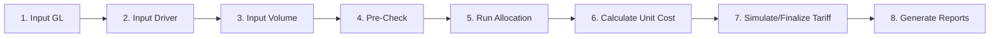

# Panduan Penggunaan WebApp KMKB
## Kurikulum Belajar & Petunjuk Teknis Terintegrasi

> **Versi:** Desember 2025  
> **Platform:** WebApp Costing, Tariff, dan Clinical Pathway Management System

---

## Daftar Isi

### Bagian A: Landasan Teori & Prinsip
1. [Prinsip Dasar Analisis Biaya (Defining the Final Product)](#bagian-a-prinsip-dasar-analisis-biaya)
2. [Defining Cost Centres (Mendefinisikan Pusat Biaya)](#defining-cost-centres-mendefinisikan-pusat-biaya)

### Bagian B: Modul Pembelajaran & Petunjuk Teknis
- [Modul 1-5: Dasar-Dasar Costing Rumah Sakit](#modul-1-5-dasar-dasar-costing-rumah-sakit)
- [Modul 6-8: Cost Allocation](#modul-6-8-cost-allocation)
- [Modul 9-10: Unit Costing](#modul-9-10-unit-costing)
- [Modul 11-13: Clinical Pathway](#modul-11-13-clinical-pathway)
- [Modul 14-21: Tariff Management](#modul-14-21-tariff-management)

### Bagian C: Referensi Operasional
- [Ikhtisar Peran & Menu](#ikhtisar-peran--menu)
- [Workflow Cepat End-to-End](#workflow-cepat-end-to-end)
- [Troubleshooting](#troubleshooting)
- [Lampiran & Template](#lampiran--template)

---

# BAGIAN A: PRINSIP DASAR ANALISIS BIAYA

## Defining the Final Product of Cost Analysis

Sebelum memulai proses costing, penting memahami prinsip-prinsip dasar dalam mendefinisikan "produk akhir" dari analisis biaya.

### A.1. Menentukan Layanan/Unit untuk Unit Cost

**Prinsip:** Tentukan apakah unit cost dihitung secara agregat (seluruh RS), per departemen, atau per bangsal.

**Faktor penentu:**
- **Tujuan analisis**: Perbandingan antar departemen → per departemen. Perbandingan antar RS → agregat.
- **Ketersediaan data**: Granular membutuhkan data detail di level tersebut.

**Implementasi di Webapp:**

| Fitur | Menu | Keterangan |
|-------|------|------------|
| Cost Centers hierarkis | Master Data → Cost Centers | Mendukung struktur parent-child |
| Tipe Cost Center | Master Data → Cost Centers | Pembedaan `revenue` vs `support` |
| Lokasi fisik | Master Data → Cost Centers | Field building, floor, division |
| Cost References | Master Data → Cost References | Layanan terhubung ke cost center |

**Rekomendasi:**
```
Perbandingan antar-RS       → 1 Cost Center agregat per jenis layanan
Perbandingan antar-bangsal  → Cost Center terpisah per bangsal (VIP, Kelas 1, ICU, dsb)
Analisis detail layanan     → Cost References yang terhubung ke Cost Center
```

---

### A.2. Final Product vs Intermediate Output

**Prinsip:** Lab dan Radiologi bisa sebagai:
- **Final product**: unit cost tersendiri
- **Intermediate**: dialokasikan ke rawat inap/jalan

**Status di Webapp:**

| Cost Center | Tipe | Perlakuan |
|-------------|------|-----------|
| IGD, Rawat Inap, Rawat Jalan | Revenue | Final product |
| Laboratorium, Radiologi, OK | Revenue | Final product (default) |
| Administrasi, Laundry, Kebersihan | Support | Intermediate → dialokasikan |

> **[!IMPORTANT]**
> Tetap konsisten dalam pemilihan final/intermediate sepanjang periode analisis. Dokumentasikan di Knowledge References.

> **[!NOTE] Catatan Pengembangan**
> Toggle otomatis final/intermediate belum tersedia. Perlu penyesuaian manual di Allocation Maps.

---

### A.3. Satuan Output untuk Final Cost Centre

| Jenis Layanan | Satuan Output | Fitur Sync di Webapp |
|---------------|---------------|----------------------|
| Rawat Inap | Inpatient-days atau Admissions | ✅ Via `Service Volume Current → Rawat Inap` |
| Rawat Jalan | Visits (kunjungan) | ✅ Via `Service Volume Current` |
| Laboratorium | Jumlah tes | ✅ Via `Service Volume Current → Laboratorium` |
| Radiologi | Jumlah pemeriksaan | ✅ Via `Service Volume Current → Radiologi` |
| Kamar Operasi | Jumlah operasi | ✅ Via `Service Volume Current → Bedah Sentral` |
| Farmasi | Jumlah resep/item | Manual / Import Excel |

**Formula:**
```
Unit Cost = (Direct Cost + Indirect Cost) / Service Volume
```

**Menu:**
1. **Input Data:** `GL & Expenses → Service Volumes` (Bisa import Excel atau Sync)
2. **Master Satuan:** `Master Data → Units of Measurement` (Gunakan satuan standar)

> **[!TIP]**
> - Sepakati di awal: rawat inap menggunakan `patient-days` atau `admissions`.
> - Gunakan fitur **Sync** di menu `Service Volume Current` untuk menarik data volume otomatis dari modul operasional tanpa input manual.
> - Pastikan satuan (Unit) yang digunakan di Cost References konsisten dengan Master UoM.

---

### A.4. Periode Data

| Tujuan | Periode |
|--------|---------|
| Monitoring internal cepat | Bulanan/Triwulan |
| Perbandingan antar RS | Tahunan (menghilangkan variasi musiman) |

**Default webapp:** Bulanan (`period_year`, `period_month`)

> **[!NOTE] Catatan Pengembangan**
> Agregasi triwulan/tahunan otomatis belum tersedia. Lakukan agregasi manual via Excel atau gunakan Reports → Unit Cost Summary untuk multi-periode.

---

## Defining Cost Centres (Mendefinisikan Pusat Biaya)

Langkah penting dalam menghitung unit cost adalah menentukan **cost centres** di rumah sakit, yaitu unit kegiatan tempat biaya langsung dan tidak langsung akan dibebankan.

### A.5. Apa itu Cost Centre?

**Cost Centre** adalah pusat aktivitas/unit kerja di mana biaya dialokasikan dan diukur.

**Jenis biaya yang dibebankan:**

| Kategori | Contoh | Keterangan |
|----------|--------|------------|
| **Biaya Langsung (Direct Costs)** | Gaji, bahan habis pakai, jasa, perjalanan, sewa | Dapat ditelusuri langsung ke cost centre |
| **Biaya Tidak Langsung (Indirect Costs)** | Depresiasi, alokasi dari departemen lain | Dialokasikan melalui cost allocation |

**Implementasi di Webapp:**
- Menu: `Master Data → Cost Centers`
- Setiap cost center memiliki: kode, nama, tipe, building, floor, division

---

### A.6. Mengapa Cost Centre Harus Selaras dengan Struktur Organisasi?

**Alasan manajerial:**
1. Rumah sakit **diorganisasi dalam departemen/unit kerja**
2. Cost centre yang selaras memberikan **"peta rute"** untuk menyalurkan biaya melalui proses cost-finding
3. Membantu manajer melihat **penggunaan sumber daya vs anggaran** dan layanan yang dihasilkan
4. Menjadi kerangka untuk menghitung biaya fungsi yang berbeda pada setiap unit

**Implementasi di Webapp:**

```
┌─────────────────────────────────────────────────────────────┐
│  STRUKTUR ORGANISASI RS    →    STRUKTUR COST CENTER        │
├─────────────────────────────────────────────────────────────┤
│  Direktorat Pelayanan      →    Revenue Centers             │
│  ├── IGD                   →    ├── IGD                     │
│  ├── Rawat Jalan           →    ├── Rawat Jalan             │
│  └── Rawat Inap            →    └── Rawat Inap per Bangsal  │
│                                                              │
│  Direktorat Penunjang      →    Intermediate Centers        │
│  ├── Laboratorium          →    ├── Lab Klinik              │
│  ├── Radiologi             →    ├── Radiologi               │
│  └── Farmasi               →    └── Farmasi                 │
│                                                              │
│  Direktorat Umum           →    Overhead/Support Centers    │
│  ├── Keuangan              →    ├── Keuangan                │
│  ├── SDM                   →    ├── SDM                     │
│  └── Umum                  →    └── Housekeeping, Laundry   │
└─────────────────────────────────────────────────────────────┘
```

> **[!TIP]**
> Gunakan field `division` di Cost Center untuk mengelompokkan sesuai struktur organisasi RS Anda.

---

### A.7. Klasifikasi Cost Centre

Secara administratif, cost centre dibedakan menurut **sifat pekerjaan** (Concept), namun di Webapp disederhanakan menjadi **Tipe** (System):

| Klasifikasi (Konsep) | Deskripsi | Contoh | Tipe di Webapp |
|----------------------|-----------|--------|----------------|
| **Patient Care** | Unit yang memberi layanan pasien secara langsung | Bangsal/rawat inap, Unit rawat jalan, IGD, OK | `revenue` |
| **Intermediate** | Layanan penunjang klinis, bisa menjadi *final product* atau dialokasikan lagi | Laboratorium, Farmasi, Radiologi | `revenue` |
| **Overhead** | Layanan dukungan umum (Non-Revenue) | Keuangan, Gizi, Keamanan, Housekeeping | `support` |

> **[!NOTE]**
> Di Webapp, **Intermediate** dan **Patient Care** sama-sama bertipe `revenue` karena keduanya memiliki **Cost References** (layanan yang bisa dihitung unit cost-nya dan dijual). Bedanya hanya pada alur pelayanan klinisnya.

**Alur biaya mengikuti step-down:**
```
Overhead (Support) → Intermediate (Revenue) → Patient Care (Revenue)
       └───────────────────────────────────────────┘
```

**Implementasi di Webapp:**
- Patient Care & Intermediate: set tipe `revenue` di Master Data → Cost Centers
- Overhead: set tipe `support` di Master Data → Cost Centers
- Alokasi diatur di: `Allocation → Allocation Maps`

---

### A.8. Berapa Banyak Cost Centre yang Perlu Dibuat?

**Prinsip:** Tingkat rincian cost centre ditentukan oleh **kebutuhan analisis**.

| Kebutuhan Analisis | Tingkat Rincian | Contoh |
|--------------------|-----------------|--------|
| Unit cost per bangsal | Setiap bangsal = 1 cost centre | VIP, Kelas 1, Kelas 2, Kelas 3, ICU, NICU |
| Unit cost per jenis penunjang | Setiap jenis = 1 cost centre | Lab Klinik, Lab PA, X-Ray, CT Scan, MRI |
| Analisis agregat | Gabungan = 1 cost centre | Rawat Inap (semua kelas), Penunjang Medis |

**Rekomendasi granularitas:**

| Tingkat | Kelebihan | Kekurangan |
|---------|-----------|------------|
| **Detail** | Analisis mendalam, benchmarking per unit | Butuh data lebih banyak, kompleks |
| **Agregat** | Lebih mudah, cukup untuk perbandingan antar RS | Kurang detail, tidak bisa lihat per unit |

> **[!IMPORTANT]**
> Keputusan granularitas harus diambil **di awal** dan tetap konsisten sepanjang periode analisis.

**Implementasi di Webapp:**
- Buat cost center sesuai tingkat rincian yang diperlukan
- Gunakan parent-child hierarchy jika perlu struktur bertingkat
- Dokumentasikan keputusan di Knowledge References

---

### A.9. Untuk Cost Centre Mana Unit Cost Dihitung?

**Tujuan utama:** Mengalokasikan semua biaya RS ke pusat-pusat yang akan diukur unit cost-nya.

| Target Utama | Contoh | Satuan Output |
|--------------|--------|---------------|
| **Patient Care Centres** | Bangsal maternitas, klinik rawat jalan, unit anak | Per admission, per patient-day, per visit |
| **Intermediate Departments** (jika perlu) | Laboratorium, Radiologi, Farmasi | Per tes, per pemeriksaan, per resep |
| **Overhead tertentu** (kasus khusus) | Gizi, Laundry | Per porsi, per kg linen |

**Kapan menghitung unit cost untuk overhead?**
- Untuk menilai opsi **outsourcing** (misal: kontrak catering vs gizi internal)
- Untuk **benchmarking** kinerja unit overhead antar RS
- Untuk **cost recovery analysis** layanan internal

**Implementasi di Webapp:**
- Unit cost dihitung untuk Cost References yang terhubung ke revenue cost center
- Menu: `Unit Costing → Calculate Unit Cost`

---

### A.10. Memisahkan Cost Centre Penghasil Pendapatan vs Non-Pendapatan

Untuk analisis **cost recovery** (sejauh mana tarif menutup biaya), perlu membedakan:

| Kategori | Deskripsi | Contoh | Perlakuan |
|----------|-----------|--------|-----------|
| **Revenue-Producing** | Menghasilkan pendapatan dari pasien | Patient care, Intermediate | Final cost centre (unit cost dihitung) |
| **Non-Revenue** | Tidak menghasilkan pendapatan langsung | Security, Housekeeping, Payroll | Biaya dialokasikan ke revenue-producing |

**Contoh tarif yang dapat dianalisis cost recovery-nya:**
- Biaya kamar, makan, keperawatan (tarif harian)
- Obat dan balutan
- X-ray, lab, fisioterapi

**Implementasi di Webapp:**
- Revenue-producing: Tipe `revenue` di Cost Centers
- Non-revenue: Tipe `support` di Cost Centers
- Semua biaya support dialokasikan ke revenue melalui step-down allocation

---

### A.11. Dua Versi Unit Cost: Dengan atau Tanpa Biaya Penunjang

Dalam analisis, Anda mungkin perlu menghitung **dua jenis unit cost**:

| Versi | Deskripsi | Kegunaan |
|-------|-----------|----------|
| **Termasuk biaya penunjang** | Unit cost mencakup alokasi biaya lab, radiologi, farmasi | Total cost per admission, cost recovery analysis |
| **Tidak termasuk biaya penunjang** | Unit cost hanya biaya langsung + overhead non-klinis | Analisis efisiensi unit, benchmarking per layanan |

**Contoh praktis:**

```
Biaya per admission rawat inap:
├── Versi 1 (dengan penunjang):  Rp 5.000.000
│   ├── Biaya langsung rawat inap:  Rp 2.500.000
│   ├── Overhead dialokasikan:      Rp 1.000.000
│   └── Penunjang (lab, rad):       Rp 1.500.000
│
└── Versi 2 (tanpa penunjang):   Rp 3.500.000
    ├── Biaya langsung rawat inap:  Rp 2.500.000
    └── Overhead dialokasikan:      Rp 1.000.000
```

> **[!NOTE] Catatan Pengembangan**
> Webapp saat ini menghitung unit cost dengan metode standar (termasuk alokasi overhead). Fitur dual-view reporting (dengan/tanpa biaya penunjang dialokasikan) direncanakan untuk pengembangan mendatang:
> - [ ] Toggle include/exclude intermediate allocation
> - [ ] Laporan perbandingan dua versi
> - [ ] Dashboard dual-view

**Workaround saat ini:**
1. Jalankan dua skenario Allocation Maps:
   - Skenario A: Lab/Radiologi sebagai final product (tidak dialokasikan)
   - Skenario B: Lab/Radiologi dialokasikan ke patient care
2. Hitung unit cost untuk masing-masing skenario
3. Dokumentasikan kedua hasil di Knowledge References

---

### Ringkasan Kesesuaian Webapp dengan Literatur

| Prinsip | Status | Catatan |
|---------|--------|---------|
| Cost center fleksibel | ✅ Tersedia | Hierarki, tipe, lokasi |
| Revenue vs Support | ✅ Tersedia | Step-down allocation |
| Klasifikasi 3-tier (Patient/Intermediate/Overhead) | ✅ Tersedia | Tipe revenue & support |
| Selaras struktur organisasi | ✅ Tersedia | Field division, building |
| Multiple output measures | ✅ Tersedia | Service Volumes per layanan |
| Periode bulanan | ✅ Tersedia | Default per bulan |
| Agregasi triwulan/tahunan | ⚠️ Manual | Perlu pengembangan |
| Dual reporting (dengan/tanpa penunjang) | ⚠️ Manual | Workaround via Allocation Maps |
| Toggle final/intermediate | ⚠️ Manual | Via Allocation Maps |

---

# BAGIAN B: MODUL PEMBELAJARAN & PETUNJUK TEKNIS

---

## MODUL 1-5: DASAR-DASAR COSTING RUMAH SAKIT

### Modul 1: Dasar-Dasar Biaya Rumah Sakit

**🎯 Tujuan Pembelajaran:**
Memahami konsep dasar akuntansi biaya rumah sakit dan terminologi yang digunakan dalam proses costing.

---

#### 1.1. Pengertian Biaya (Cost)

**Definisi:**
> **Biaya (Cost)** adalah pengorbanan sumber daya ekonomi yang dapat diukur dalam satuan uang, yang terjadi atau berpotensi terjadi untuk mencapai tujuan tertentu.

**Komponen penting:**
- **Pengorbanan ekonomi**: Uang tunai, aset, atau kewajiban
- **Dapat diukur**: Dalam satuan moneter (Rupiah)
- **Tujuan tertentu**: Menghasilkan barang/jasa

**Perbedaan Biaya vs Beban:**

| Aspek | Biaya (Cost) | Beban (Expense) |
|-------|--------------|-----------------|
| Waktu | Saat pengorbanan terjadi | Saat diakui dalam laporan laba-rugi |
| Contoh | Pembelian obat Rp 10 juta | Obat yang sudah terpakai pasien |
| Posisi | Aset (jika belum habis) | Laporan laba-rugi |

**Implementasi di Webapp:**
- Menu `GL & Expenses → GL Expenses` mencatat **beban/expense** yang sudah direalisasi per periode
- Sistem mengkonversi beban menjadi biaya per cost center untuk perhitungan unit cost

---

#### 1.2. Cost Object (Objek Biaya)

**Definisi:**
> **Cost Object** adalah entitas yang menjadi target pengukuran biaya — sesuatu yang ingin kita ketahui berapa biayanya.

**Contoh Cost Object di Rumah Sakit:**

| Tingkat | Cost Object | Contoh Pertanyaan |
|---------|-------------|-------------------|
| Layanan | Tes laboratorium | Berapa biaya 1 tes darah lengkap? |
| Pasien | Episode perawatan | Berapa biaya merawat pasien apendisitis? |
| Departemen | Unit rawat inap | Berapa total biaya operasional rawat inap? |
| Produk | Clinical pathway | Berapa biaya standar appendectomy? |

**Implementasi di Webapp:**
- **Cost References** (`Master Data → Cost References`) adalah representasi cost object untuk layanan individual
- Setiap Cost Reference memiliki: kode layanan, nama, kategori, satuan, dan keterkaitan dengan cost center
- Unit cost dihitung per cost reference berdasarkan beban + alokasi overhead

---

#### 1.3. Cost Pool (Kelompok Biaya)

**Definisi:**
> **Cost Pool** adalah sekumpulan biaya yang dikelompokkan berdasarkan karakteristik yang sama untuk kemudian dialokasikan ke cost object.

**Jenis-jenis Cost Pool:**

```
┌─────────────────────────────────────────────────────────────┐
│                    TOTAL BIAYA RUMAH SAKIT                  │
├─────────────────────────────────────────────────────────────┤
│  ┌─────────────────┐  ┌─────────────────┐  ┌─────────────┐  │
│  │  DIRECT COST    │  │  INDIRECT COST  │  │  OVERHEAD   │  │
│  │     POOL        │  │     POOL        │  │    POOL     │  │
│  ├─────────────────┤  ├─────────────────┤  ├─────────────┤  │
│  │ • Obat          │  │ • Gaji admin    │  │ • Listrik   │  │
│  │ • BHP Medis     │  │ • Depresiasi    │  │ • Air       │  │
│  │ • Gaji dokter   │  │   gedung        │  │ • Keamanan  │  │
│  │   spesialis     │  │ • IT Support    │  │ • Laundry   │  │
│  └─────────────────┘  └─────────────────┘  └─────────────┘  │
└─────────────────────────────────────────────────────────────┘
```

**Implementasi di Webapp:**
- **Expense Categories** (`Master Data → Expense Categories`) mendefinisikan struktur cost pool
- Hierarki COA (Chart of Accounts) membantu mengelompokkan biaya serupa
- Contoh: Kategori "Gaji & Tunjangan" mengelompokkan semua biaya personel

---

#### 1.4. Klasifikasi Biaya Berdasarkan Perilaku

##### a) Fixed Cost (Biaya Tetap)

**Definisi:**
> Biaya yang total nominalnya **tetap** dalam rentang aktivitas tertentu, tidak terpengaruh oleh naik-turunnya volume layanan.

**Karakteristik:**
- Total tetap, per unit berubah (turun jika volume naik)
- Periode: jangka pendek hingga menengah

**Contoh di Rumah Sakit:**

| Jenis Biaya | Nominal/Bulan | Berubah oleh Volume? |
|-------------|---------------|----------------------|
| Gaji pegawai tetap | Rp 500 juta | ❌ Tidak |
| Sewa gedung | Rp 100 juta | ❌ Tidak |
| Depresiasi alat CT-Scan | Rp 50 juta | ❌ Tidak |
| Lisensi software SIMRS | Rp 10 juta | ❌ Tidak |

**Formula:**
```
Fixed Cost per Unit = Total Fixed Cost / Volume
Contoh: Rp 500 juta / 1.000 pasien = Rp 500.000/pasien
        Rp 500 juta / 2.000 pasien = Rp 250.000/pasien ← turun!
```

##### b) Variable Cost (Biaya Variabel)

**Definisi:**
> Biaya yang total nominalnya **berubah proporsional** dengan volume aktivitas, namun biaya per unitnya cenderung tetap.

**Karakteristik:**
- Total berubah, per unit tetap
- Langsung terkait dengan output/layanan

**Contoh di Rumah Sakit:**

| Jenis Biaya | Biaya/Unit | Volume | Total |
|-------------|------------|--------|-------|
| Obat per pasien | Rp 100.000 | 1.000 | Rp 100 juta |
| Obat per pasien | Rp 100.000 | 2.000 | Rp 200 juta |
| Reagent lab per tes | Rp 15.000 | 5.000 | Rp 75 juta |
| BHP per tindakan | Rp 50.000 | 200 | Rp 10 juta |

##### c) Semi-Variable / Mixed Cost (Biaya Semi-Variabel)

**Definisi:**
> Biaya yang memiliki **komponen tetap** dan **komponen variabel** sekaligus.

**Formula:**
```
Total Cost = Fixed Component + (Variable Rate × Volume)
```

**Contoh di Rumah Sakit:**

| Jenis Biaya | Komponen Tetap | Komponen Variabel |
|-------------|----------------|-------------------|
| Listrik | Rp 50 juta (abodemen) | + Rp 1.500/kWh pemakaian |
| Telepon | Rp 5 juta (langganan) | + Rp 500/menit panggilan |
| Gaji dengan lembur | Rp 10 juta (gaji pokok) | + Rp 100.000/jam lembur |

**Relevansi untuk Webapp:**

> [!NOTE]
> Webapp KMKB saat ini tidak membedakan fixed/variable dalam perhitungan otomatis. Semua biaya di GL Expenses diperlakukan sebagai total cost per periode. Pemisahan fixed/variable dilakukan pada analisis lanjutan atau pelaporan manual.

---

#### 1.5. Direct Cost vs Indirect Cost

##### Direct Cost (Biaya Langsung)

**Definisi:**
> Biaya yang dapat **ditelusuri secara langsung** dan **ekonomis** ke cost object tertentu.

**Kriteria "langsung":**
- ✅ Ada hubungan sebab-akibat jelas
- ✅ Dapat diukur untuk objek tersebut
- ✅ Secara ekonomis layak ditelusuri

**Contoh:**

| Cost Object | Direct Cost | Mengapa Langsung? |
|-------------|-------------|-------------------|
| Tes Lab Darah Lengkap | Reagent, tabung sampel | Terpakai khusus untuk tes ini |
| Rawat Inap VIP | Makanan pasien VIP, amenities | Khusus untuk pasien tersebut |
| Operasi Appendectomy | Disposable surgical kit | Terpakai habis untuk operasi ini |

##### Indirect Cost (Biaya Tidak Langsung)

**Definisi:**
> Biaya yang **tidak dapat ditelusuri langsung** ke cost object tertentu karena dipakai bersama oleh banyak cost object.

**Contoh:**

| Biaya | Dipakai Oleh | Cara Alokasi |
|-------|--------------|--------------|
| Gaji satpam | Semua unit | Dibagi berdasarkan luas lantai |
| Listrik gedung | Semua lantai | Dibagi berdasarkan meter/pemakaian |
| Gaji direktur | Semua departemen | Dibagi berdasarkan eksposur manajemen |

**Implementasi di Webapp:**

| Konsep | Fitur di Webapp | Menu |
|--------|-----------------|------|
| Direct Cost | GL Expenses langsung ke cost center | `GL & Expenses → GL Expenses` |
| Indirect Cost | Dialokasikan via Allocation Engine | `Allocation → Run Allocation` |
| Allocation Driver | Dasar pembagi (luas, FTE, kg) | `Master Data → Allocation Drivers` |
| Allocation Map | Aturan source → target | `Allocation → Allocation Maps` |

---

#### 1.6. Overhead & Cost Center

##### Overhead (Biaya Overhead)

**Definisi:**
> Semua biaya **tidak langsung** yang diperlukan untuk menjalankan operasional tetapi tidak dapat ditelusuri ke layanan spesifik.

**Kategori Overhead Rumah Sakit:**

```
OVERHEAD
├── Overhead Umum (General Overhead)
│   ├── Manajemen & Administrasi
│   ├── Keuangan & Akuntansi
│   ├── SDM & Kepegawaian
│   └── IT & Sistem Informasi
│
├── Overhead Fasilitas (Facility Overhead)
│   ├── Depresiasi gedung
│   ├── Pemeliharaan gedung
│   ├── Utilitas (listrik, air, gas)
│   └── Keamanan & kebersihan
│
└── Overhead Penunjang (Support Overhead)
    ├── Laundry
    ├── Gizi / Catering
    ├── CSSD (Sterilisasi)
    └── IPSRS (Pemeliharaan alat)
```

##### Cost Center (Pusat Biaya)

**Definisi:**
> Unit organisasi di mana biaya dikumpulkan dan diukur. Manajer cost center bertanggung jawab atas pengendalian biaya di unitnya.

**Tipe Cost Center:**

| Tipe | Deskripsi | Contoh | Di Webapp |
|------|-----------|--------|-----------|
| **Revenue Center** | Menghasilkan pendapatan langsung | IGD, Poliklinik, Rawat Inap, OK | Tipe: `revenue` |
| **Support Center** | Mendukung operasional, tidak ada pendapatan | Administrasi, Laundry, Gizi | Tipe: `support` |

**Implementasi di Webapp:**

```
Menu: Master Data → Cost Centers

┌────────────────────────────────────────────────────────────────┐
│  Field               │  Deskripsi                              │
├────────────────────────────────────────────────────────────────┤
│  Kode               │  Kode unik (mis: CC-RI-01)               │
│  Nama               │  Nama cost center                        │
│  Tipe               │  revenue / support                       │
│  Building           │  Gedung lokasi                           │
│  Floor              │  Lantai                                  │
│  Division           │  Divisi/direktorat                       │
│  Parent             │  Induk (untuk hierarki)                  │
└────────────────────────────────────────────────────────────────┘
```

---

#### 1.7. Mengapa Unit Cost Penting?

**Definisi Unit Cost:**
> **Unit Cost** adalah total biaya yang diperlukan untuk menghasilkan/menyediakan **satu unit** layanan atau produk.

**Formula Dasar:**
```
Unit Cost = Total Cost / Volume Layanan
         = (Direct Cost + Allocated Overhead) / Jumlah Unit
```

**Manfaat Perhitungan Unit Cost:**

| No | Manfaat | Contoh Penggunaan |
|----|---------|-------------------|
| 1 | **Penetapan Tarif** | Unit cost + margin = tarif layanan |
| 2 | **Analisis Profitabilitas** | Bandingkan tarif vs unit cost per layanan |
| 3 | **Efisiensi Operasional** | Identifikasi layanan berbiaya tinggi |
| 4 | **Negosiasi Kontrak** | Dasar negosiasi dengan BPJS/asuransi |
| 5 | **Budgeting** | Proyeksi biaya berdasarkan target volume |
| 6 | **Benchmarking** | Perbandingan antar RS atau antar periode |

**Contoh Perhitungan Sederhana:**

```
Layanan: Tes Laboratorium Darah Lengkap
─────────────────────────────────────────
Direct Cost per bulan:
  • Reagent:              Rp 15.000.000
  • BHP (tabung, dll):    Rp  3.000.000
  • Gaji analis lab:      Rp 10.000.000
                          ─────────────
  Subtotal Direct:        Rp 28.000.000

Allocated Overhead:
  • Listrik lab:          Rp  2.000.000
  • Depresiasi alat:      Rp  5.000.000
  • Overhead RS:          Rp  3.000.000
                          ─────────────
  Subtotal Overhead:      Rp 10.000.000

Total Cost:               Rp 38.000.000
Volume bulan ini:         2.000 tes
─────────────────────────────────────────
Unit Cost = Rp 38.000.000 / 2.000
          = Rp 19.000 per tes
```

---

#### 🛠 Aktivitas Praktik di Webapp

**Tujuan:** Mengenali implementasi konsep-konsep di atas dalam sistem KMKB.

| No | Langkah | Menu | Aksi | Konsep yang Dipelajari |
|----|---------|------|------|------------------------|
| 1 | Lihat struktur COA | `Master Data → Expense Categories` | Eksplorasi hierarki kategori | Cost Pool |
| 2 | Pahami tipe kategori | `Master Data → Expense Categories` | Perhatikan pengelompokan | Direct vs Indirect |
| 3 | Lihat cost center | `Master Data → Cost Centers` | Filter by tipe | Revenue vs Support |
| 4 | Lihat layanan | `Master Data → Cost References` | Klik detail | Cost Object |
| 5 | Lihat driver | `Master Data → Allocation Drivers` | Pahami jenis driver | Dasar alokasi overhead |

**Checklist Pemahaman:**
- [ ] Saya dapat membedakan fixed, variable, dan semi-variable cost
- [ ] Saya memahami perbedaan direct vs indirect cost
- [ ] Saya mengerti mengapa overhead perlu dialokasikan
- [ ] Saya paham cost center sebagai pusat akumulasi biaya
- [ ] Saya memahami pentingnya unit cost untuk pengambilan keputusan

---

**📤 Output:**
Pemahaman fundamental yang solid tentang terminologi dan konsep dasar akuntansi biaya rumah sakit, sebagai fondasi untuk modul-modul selanjutnya.

---

### Modul 2: Cost Center Rumah Sakit

**🎯 Tujuan Pembelajaran:**
Mampu mengidentifikasi, mengklasifikasikan, dan mendesain struktur cost center yang selaras dengan organisasi rumah sakit untuk keperluan akumulasi dan alokasi biaya.

---

#### 2.1. Pengertian Cost Center

**Definisi:**
> **Cost Center** (Pusat Biaya) adalah unit organisasi, aktivitas, atau lokasi di mana biaya dikumpulkan, diukur, dan dikendalikan. Setiap cost center memiliki manajer/penanggungjawab yang accountable terhadap penggunaan sumber daya di unitnya.

**Karakteristik Cost Center:**

| Aspek | Deskripsi |
|-------|-----------|
| **Identitas** | Memiliki kode dan nama unik |
| **Batasan** | Jelas secara organisasi atau fisik |
| **Akuntabilitas** | Ada penanggung jawab/manajer |
| **Measurable** | Aktivitas dan output dapat diukur |
| **Cost Accumulation** | Tempat biaya dikumpulkan |

**Mengapa Cost Center Penting?**

```
┌─────────────────────────────────────────────────────────────────┐
│                    FUNGSI COST CENTER                           │
├─────────────────────────────────────────────────────────────────┤
│  1. AKUMULASI BIAYA                                             │
│     └── Mengumpulkan semua biaya yang terjadi di unit tersebut  │
│                                                                 │
│  2. PENGENDALIAN BIAYA                                          │
│     └── Membandingkan realisasi vs anggaran per unit            │
│                                                                 │
│  3. ALOKASI BIAYA                                               │
│     └── Sebagai source/target dalam proses cost allocation      │
│                                                                 │
│  4. PERHITUNGAN UNIT COST                                       │
│     └── Basis untuk menghitung biaya per layanan                │
│                                                                 │
│  5. PELAPORAN MANAJERIAL                                        │
│     └── Laporan kinerja per unit/departemen                     │
└─────────────────────────────────────────────────────────────────┘
```

---

#### 2.2. Klasifikasi Cost Center di Rumah Sakit

Berdasarkan **fungsi dan karakteristik pendapatan**, cost center rumah sakit diklasifikasikan menjadi tiga kategori utama:

##### a) Revenue Center (Pusat Pendapatan)

**Definisi:**
> Cost center yang **menghasilkan pendapatan langsung** dari layanan kepada pasien. Layanan ini dapat ditagihkan (billable) dan memiliki tarif.

**Karakteristik:**
- Berinteraksi langsung dengan pasien
- Memiliki tarif layanan
- Output dapat diukur (kunjungan, hari rawat, tindakan)
- Menjadi **target akhir** alokasi biaya (final cost centre)

**Contoh Revenue Center:**

| Kategori | Unit | Satuan Output |
|----------|------|---------------|
| **Rawat Jalan** | Poliklinik Umum, Spesialis | Kunjungan (visit) |
| **Rawat Inap** | Bangsal per Kelas, ICU, NICU, HCU | Hari rawat (patient-day) |
| **Gawat Darurat** | IGD, Triage | Kunjungan |
| **Kamar Operasi** | OK Mayor, OK Minor, OK Cito | Jumlah operasi |
| **Penunjang Klinis** | Lab, Radiologi, Rehabilitasi Medik | Jumlah pemeriksaan |

##### b) Support Center / Overhead Center (Pusat Pendukung)

**Definisi:**
> Cost center yang **tidak menghasilkan pendapatan langsung** tetapi menyediakan layanan pendukung untuk operasional rumah sakit secara keseluruhan.

**Karakteristik:**
- Tidak berinteraksi langsung dengan pasien dalam konteks klinis
- Tidak memiliki tarif kepada pasien
- Biayanya **dialokasikan** ke revenue center
- Menjadi **source** dalam proses step-down allocation

**Contoh Support Center:**

| Kategori | Unit | Layanan yang Diberikan |
|----------|------|------------------------|
| **Administrasi Umum** | Direksi, Sekretariat | Manajemen, koordinasi |
| **Keuangan** | Akuntansi, Kasir, Penagihan | Pengelolaan keuangan |
| **SDM** | HRD, Diklat | Pengelolaan pegawai |
| **Logistik** | Gudang, Pengadaan | Pengelolaan barang |
| **Rumah Tangga** | Housekeeping, Laundry, Keamanan | Kebersihan, keamanan |
| **Pemeliharaan** | IPSRS, IPAL | Maintenance gedung & alat |
| **IT** | Sistem Informasi | Pengelolaan TI |
| **Gizi** | Instalasi Gizi | Makanan pasien & pegawai |

##### c) Intermediate Center (Pusat Penunjang Klinis)

**Definisi:**
> Cost center yang menyediakan **layanan klinis penunjang** yang dapat diperlakukan sebagai:
> - **Final product** → dihitung unit cost tersendiri, ATAU
> - **Intermediate** → biayanya dialokasikan ke rawat inap/jalan

**Karakteristik:**
- Berinteraksi dengan pasien tetapi bukan layanan utama
- Memiliki tarif (jika sebagai final product)
- Fleksibel: bisa sebagai penghasil pendapatan atau cost pool yang dialokasikan

**Contoh Intermediate Center:**

| Unit | Sebagai Final Product | Sebagai Intermediate |
|------|----------------------|---------------------|
| **Laboratorium** | Unit cost per tes lab | Biaya lab masuk ke unit cost rawat inap |
| **Radiologi** | Unit cost per pemeriksaan | Biaya imaging masuk ke unit cost rawat jalan |
| **Farmasi** | Unit cost per resep | Biaya farmasi dialokasikan ke layanan klinis |
| **CSSD** | Unit cost per set steril | Biaya CSSD dialokasikan ke OK, rawat inap |

> [!IMPORTANT]
> **Keputusan Desain:** Tentukan di awal apakah unit penunjang diperlakukan sebagai final product atau intermediate. Keputusan ini mempengaruhi setup **Allocation Maps** dan hasil unit cost.

---

#### 2.3. Visualisasi Alur Biaya Antar Cost Center

```
┌─────────────────────────────────────────────────────────────────────────┐
│                        ALUR BIAYA RUMAH SAKIT                           │
│                         (Step-Down Method)                              │
├─────────────────────────────────────────────────────────────────────────┤
│                                                                         │
│  LAYER 1: OVERHEAD / SUPPORT                                            │
│  ┌──────────┐ ┌──────────┐ ┌──────────┐ ┌──────────┐ ┌──────────┐       │
│  │Administrasi│ │ Keuangan │ │   SDM    │ │ Laundry  │ │   Gizi   │      │
│  └─────┬────┘ └─────┬────┘ └─────┬────┘ └─────┬────┘ └─────┬────┘       │
│        │            │            │            │            │            │
│        ▼            ▼            ▼            ▼            ▼            │
│  ══════════════════════════════════════════════════════════════════     │
│                          ALOKASI STEP 1-5                               │
│  ══════════════════════════════════════════════════════════════════     │
│        │            │            │            │            │            │
│        ▼            ▼            ▼            ▼            ▼            │
│  LAYER 2: INTERMEDIATE (Opsional sebagai final)                         │
│  ┌──────────┐ ┌──────────┐ ┌──────────┐ ┌──────────┐                    │
│  │   Lab    │ │ Radiologi│ │  Farmasi │ │   CSSD   │                    │
│  └─────┬────┘ └─────┬────┘ └─────┬────┘ └─────┬────┘                    │
│        │            │            │            │                         │
│        ▼            ▼            ▼            ▼                         │
│  ══════════════════════════════════════════════════════════════════     │
│                     ALOKASI STEP 6-8 (jika intermediate)                │
│  ══════════════════════════════════════════════════════════════════     │
│        │            │            │            │                         │
│        ▼            ▼            ▼            ▼                         │
│  LAYER 3: REVENUE CENTER (Final Cost Centre)                            │
│  ┌──────────┐ ┌──────────┐ ┌──────────┐ ┌──────────┐ ┌──────────┐       │
│  │   IGD    │ │Rawat Jalan│ │Rawat Inap│ │    OK    │ │   VK     │      │
│  └──────────┘ └──────────┘ └──────────┘ └──────────┘ └──────────┘       │
│                                                                         │
│  ─────────────────────────────────────────────────────────────────      │
│  OUTPUT: Total Cost per Revenue Center → Unit Cost per Layanan          │
└─────────────────────────────────────────────────────────────────────────┘
```

---

#### 2.4. Hierarki Cost Center

Dalam praktik, cost center dapat disusun secara **hierarkis** (parent-child) untuk kebutuhan:
- **Agregasi pelaporan**: Lihat total biaya per direktorat/divisi
- **Drill-down analysis**: Detail biaya per sub-unit
- **Fleksibilitas alokasi**: Alokasi ke parent atau child

**Contoh Hierarki:**

```
Rumah Sakit XYZ
├── Bidang Pelayanan Medis
│   ├── Instalasi Rawat Jalan
│   │   ├── Poliklinik Umum
│   │   ├── Poliklinik Penyakit Dalam
│   │   ├── Poliklinik Bedah
│   │   └── Poliklinik Anak
│   ├── Instalasi Rawat Inap
│   │   ├── Bangsal VIP
│   │   ├── Bangsal Kelas 1
│   │   ├── Bangsal Kelas 2
│   │   ├── Bangsal Kelas 3
│   │   └── ICU
│   └── Instalasi Gawat Darurat
│       └── IGD
├── Bidang Penunjang Medis
│   ├── Instalasi Laboratorium
│   │   ├── Lab Klinik
│   │   └── Lab Patologi Anatomi
│   ├── Instalasi Radiologi
│   │   ├── X-Ray
│   │   ├── CT-Scan
│   │   └── MRI
│   └── Instalasi Farmasi
└── Bagian Umum & Keuangan
    ├── Bagian Keuangan
    ├── Bagian SDM
    ├── Bagian Umum
    │   ├── Housekeeping
    │   ├── Laundry
    │   └── Keamanan
    └── Bagian IT
```

**Implementasi di Webapp:**
- Field `Parent` pada form Cost Center memungkinkan pembuatan hierarki
- Hierarki ditampilkan di halaman index dengan indentasi

---

#### 2.5. Atribut Cost Center di Webapp KMKB

Setiap cost center di webapp memiliki atribut berikut:

| Atribut | Deskripsi | Contoh | Kegunaan |
|---------|-----------|--------|----------|
| **Kode** | Identifikasi unik | `CC-RI-VIP-01` | Referensi di laporan, import |
| **Nama** | Nama lengkap unit | `Rawat Inap VIP` | Display, navigasi |
| **Tipe** | Klasifikasi | `revenue` atau `support` | Logika alokasi |
| **Building** | Gedung lokasi | `Gedung A` | Grouping, alokasi utilitas |
| **Floor** | Lantai | `Lantai 2` | Alokasi kebersihan, listrik |
| **Division** | Divisi/Direktorat | `Pelayanan Medis` | Struktur organisasi |
| **Parent** | Induk hierarki | `Instalasi Rawat Inap` | Agregasi laporan |

**Kode Penamaan yang Disarankan:**

```
Format: [PREFIX]-[KATEGORI]-[SUBKATEGORI]-[NOMOR]

Contoh:
├── CC-ADM-KEU-01    → Cost Center Administrasi Keuangan
├── CC-SUP-LDR-01    → Cost Center Support Laundry
├── CC-INT-LAB-01    → Cost Center Intermediate Lab Klinik
├── CC-REV-RJ-01     → Cost Center Revenue Rawat Jalan Umum
└── CC-REV-RI-VIP    → Cost Center Revenue Rawat Inap VIP
```

---

#### 2.6. Best Practices Desain Cost Center

| No | Prinsip | Penjelasan | ✅ Do | ❌ Don't |
|----|---------|------------|-------|---------|
| 1 | **Selaras dengan Organisasi** | Cost center mengikuti struktur organisasi RS | Satu unit kerja = satu cost center | Cost center tidak jelas siapa penanggungjawabnya |
| 2 | **Granularitas Sesuai Kebutuhan** | Detail cukup untuk analisis yang diinginkan | Pisah bangsal per kelas jika perlu analisis per kelas | Terlalu detail tanpa kebutuhan analisis jelas |
| 3 | **Konsistensi Sepanjang Periode** | Struktur tidak berubah-ubah | Pertahankan struktur selama periode analisis | Mengubah struktur setiap bulan |
| 4 | **Measurable Output** | Ada ukuran output yang jelas | Revenue center punya satuan output | Cost center tanpa cara mengukur aktivitasnya |
| 5 | **Dokumentasi Keputusan** | Catat alasan desain cost center | Simpan di Knowledge References | Tidak ada dokumentasi mengapa struktur dipilih |

---

#### 2.7. Menentukan Jumlah Cost Center yang Tepat

**Faktor Pertimbangan:**

| Aspek | Pertanyaan | Implikasi |
|-------|------------|-----------|
| **Tujuan Analisis** | Apakah perlu analisis per bangsal? | Jika ya → pisahkan per bangsal |
| **Ketersediaan Data** | Apakah GL tersedia per sub-unit? | Jika tidak → gabungkan unit |
| **Kapasitas Tim** | Berapa banyak data yang bisa dikelola? | Lebih detail = lebih banyak input |
| **Benchmarking** | Apakah akan dibandingkan dengan RS lain? | Standarisasi struktur antar RS |

**Rekomendasi Jumlah:**

| Ukuran RS | Jumlah Cost Center | Keterangan |
|-----------|-------------------|------------|
| RS Tipe D (< 100 bed) | 15-25 | Agregasi layanan sejenis |
| RS Tipe C (100-200 bed) | 25-40 | Detail moderat |
| RS Tipe B (200-400 bed) | 40-60 | Detail per sub-instalasi |
| RS Tipe A (> 400 bed) | 60-100+ | Detail per bangsal/poliklinik |

---

#### 🛠 Aktivitas Praktik di Webapp

**Tujuan:** Membuat struktur cost center yang lengkap dan terorganisir.

##### Langkah 1: Persiapan Data

| No | Data yang Diperlukan | Sumber | Pemilik Data |
|----|---------------------|--------|--------------|
| 1 | Struktur organisasi RS | SK Direksi | Sekretariat/SDM |
| 2 | Daftar unit kerja | Bagan organisasi | SDM |
| 3 | Denah gedung & lantai | Sarpras | Bagian Umum |
| 4 | Daftar layanan per unit | SIMRS | IT/Rekam Medis |

##### Langkah 2: Mapping Organisasi → Cost Center

| Struktur Organisasi | Cost Center | Tipe |
|--------------------|-------------|------|
| Direktorat Umum | → | `support` (parent) |
| ├── Bagian Keuangan | → CC-SUP-KEU | `support` |
| ├── Bagian SDM | → CC-SUP-SDM | `support` |
| Direktorat Medis | → | `revenue` (parent) |
| ├── Instalasi Rawat Jalan | → CC-REV-RJ | `revenue` |
| ├── Instalasi Rawat Inap | → | `revenue` (parent) |
| │   ├── Bangsal VIP | → CC-REV-RI-VIP | `revenue` |
| │   ├── Bangsal Kelas 1 | → CC-REV-RI-K1 | `revenue` |

##### Langkah 3: Input di Webapp

| Langkah | Menu | Aksi | Tips |
|---------|------|------|------|
| 1 | `Master Data → Cost Centers` | Klik **Add New** | Mulai dari support centers |
| 2 | Form → Kode | Isi kode unik | Gunakan format standar |
| 3 | Form → Nama | Isi nama lengkap | Sesuai nama resmi unit |
| 4 | Form → Tipe | Pilih `support` atau `revenue` | Support = tidak ada tarif |
| 5 | Form → Building/Floor | Isi lokasi | Berguna untuk alokasi utilitas |
| 6 | Form → Division | Isi divisi/direktorat | Untuk grouping laporan |
| 7 | Form → Parent | Pilih induk (jika sub-unit) | Biarkan kosong untuk top-level |
| 8 | - | Klik **Simpan** | Ulangi untuk semua unit |

##### Langkah 4: Validasi Struktur

| Checklist | ✓ |
|-----------|---|
| Semua unit kerja sudah ada cost center-nya | ☐ |
| Revenue centers memiliki layanan/tarif | ☐ |
| Hierarki parent-child sudah benar | ☐ |
| Tidak ada duplikasi kode | ☐ |
| Building/Floor terisi untuk kebutuhan alokasi | ☐ |

---

#### 📤 Output Modul

Setelah menyelesaikan modul ini, Anda akan memiliki:

1. **Struktur cost center lengkap** yang mencerminkan organisasi RS
2. **Klasifikasi jelas** antara support dan revenue center
3. **Hierarki terorganisir** untuk agregasi dan drill-down
4. **Dokumentasi** keputusan desain cost center
5. **Fondasi siap** untuk proses alokasi dan perhitungan unit cost

**Checklist Pemahaman:**
- [ ] Saya memahami perbedaan revenue, support, dan intermediate center
- [ ] Saya dapat mendesain hierarki cost center sesuai struktur organisasi
- [ ] Saya mengerti atribut-atribut cost center di webapp
- [ ] Saya memahami pertimbangan granularitas cost center

---

**Sumber Data:** Struktur organisasi, bagan unit kerja, denah gedung  
**Pemilik Data:** Direksi / Keuangan / SDM / Sarpras

---

### Modul 3: Konsep Alokasi Biaya (Step-Down)

**🎯 Tujuan Pembelajaran:**
Memahami teori dasar cost allocation, jenis-jenis metode alokasi, dan konsep allocation driver sebagai fondasi sebelum menggunakan engine alokasi di webapp.

---

#### 3.1. Mengapa Perlu Alokasi Biaya?

**Permasalahan:**
> Cost center pendukung (support) seperti Administrasi, Laundry, Gizi tidak menghasilkan pendapatan langsung, tetapi biayanya **harus diperhitungkan** dalam unit cost layanan yang dijual ke pasien.

**Solusi:**
> **Cost Allocation** adalah proses **mendistribusikan biaya** dari cost center pendukung (support/overhead) ke cost center penghasil pendapatan (revenue) menggunakan dasar pembagi yang logis.

**Ilustrasi Kebutuhan Alokasi:**

```
┌─────────────────────────────────────────────────────────────────────────┐
│                    MENGAPA ALOKASI DIPERLUKAN?                          │
├─────────────────────────────────────────────────────────────────────────┤
│                                                                         │
│  SEBELUM ALOKASI:                                                       │
│  ┌────────────────┐      ┌────────────────┐      ┌────────────────┐     │
│  │   Laundry      │      │   Rawat Inap   │      │   Poliklinik   │     │
│  │   Rp 50 juta   │      │   Rp 200 juta  │      │   Rp 100 juta  │     │
│  │   (Support)    │      │   (Revenue)    │      │   (Revenue)    │     │
│  └────────────────┘      └────────────────┘      └────────────────┘     │
│         ↓                                                               │
│  Biaya Laundry tidak termasuk dalam unit cost layanan                   │
│  → Unit cost TERLALU RENDAH → Tarif tidak menutup biaya sebenarnya      │
│                                                                         │
│  ═══════════════════════════════════════════════════════════════════    │
│                                                                         │
│  SETELAH ALOKASI:                                                       │
│  ┌────────────────┐      ┌────────────────┐      ┌────────────────┐     │
│  │   Laundry      │──┬──▶│   Rawat Inap   │      │   Poliklinik   │     │
│  │   Rp 50 juta   │  │   │ Rp 200 + 40jt  │      │ Rp 100 + 10jt  │     │
│  │   (Rp 0)       │  └──▶│ = Rp 240 juta  │      │ = Rp 110 juta  │     │
│  └────────────────┘      └────────────────┘      └────────────────┘     │
│                                                                         │
│  → Biaya Laundry sudah masuk ke unit cost layanan                       │
│  → Unit cost AKURAT → Tarif mencerminkan biaya sebenarnya               │
└─────────────────────────────────────────────────────────────────────────┘
```

---

#### 3.2. Metode Alokasi Biaya

Ada tiga metode utama dalam alokasi biaya overhead:

##### a) Direct Allocation Method (Metode Langsung)

**Konsep:**
> Biaya support center dialokasikan **langsung ke revenue center** tanpa memperhitungkan layanan antar support center.

**Karakteristik:**
- ✅ Sederhana, mudah dipahami
- ❌ Mengabaikan layanan antar support (misal: SDM melayani Laundry)
- ❌ Kurang akurat

**Diagram:**
```
Support Centers          Revenue Centers
┌──────────┐            ┌──────────┐
│ Laundry  │───────────▶│Rawat Inap│
└──────────┘            └──────────┘
┌──────────┐            ┌──────────┐
│   SDM    │───────────▶│Poliklinik│
└──────────┘            └──────────┘
      ✗ Tidak ada alokasi antar support
```

##### b) Step-Down Allocation Method (Metode Bertahap) ⭐

**Konsep:**
> Biaya dialokasikan secara **bertahap/berurutan** dari support center yang paling banyak melayani unit lain, kemudian dilanjutkan ke support center berikutnya, hingga akhirnya semua biaya sampai ke revenue center.

**Karakteristik:**
- ✅ Memperhitungkan layanan antar support (satu arah)
- ✅ Lebih akurat dari direct method
- ✅ Praktis untuk implementasi
- ⚠️ Urutan (sequence) alokasi mempengaruhi hasil

**Diagram:**
```
Step 1: Administrasi dialokasikan ke semua unit (termasuk support lain)
Step 2: SDM dialokasikan ke unit yang tersisa
Step 3: Laundry dialokasikan ke revenue centers

┌─────────────┐
│Administrasi │══╦═══════════════════════════════════════════╗
└─────────────┘  ║ Step 1                                    ║
                 ▼                                           ▼
          ┌──────────┐                                ┌──────────┐
          │   SDM    │══════════════════════════╦════▶│Rawat Inap│
          └──────────┘  Step 2                  ║     └──────────┘
                 ▼                              ▼
          ┌──────────┐                   ┌──────────┐
          │ Laundry  │═══════════════════▶│Poliklinik│
          └──────────┘  Step 3           └──────────┘
```

> [!IMPORTANT]
> **Webapp KMKB menggunakan Step-Down Method** karena keseimbangan antara akurasi dan kepraktisan implementasi.

##### c) Reciprocal Allocation Method (Metode Timbal Balik)

**Konsep:**
> Memperhitungkan layanan **timbal balik antar support center** menggunakan persamaan simultan atau iterasi.

**Karakteristik:**
- ✅ Paling akurat secara teoritis
- ❌ Kompleks, membutuhkan perhitungan matriks
- ❌ Sulit dijelaskan ke manajemen

**Contoh Layanan Timbal Balik:**
- SDM mengelola pegawai Laundry
- Laundry mencuci seragam pegawai SDM

> [!NOTE]
> **Catatan Pengembangan:** Reciprocal method belum tersedia di webapp. Untuk kasus dengan layanan timbal balik signifikan, pertimbangkan estimasi proporsi dan masukkan dalam step-down sequence.

---

#### 3.3. Allocation Driver (Dasar Alokasi)

**Definisi:**
> **Allocation Driver** (atau **Cost Driver**) adalah dasar/basis yang digunakan untuk **mendistribusikan biaya** dari source cost center ke target cost center secara proporsional.

**Kriteria Driver yang Baik:**

| Kriteria | Penjelasan | Contoh Baik | Contoh Buruk |
|----------|------------|-------------|--------------|
| **Kausalitas** | Ada hubungan sebab-akibat dengan biaya | Kg linen untuk Laundry | Jumlah pasien untuk Laundry |
| **Measurable** | Dapat diukur secara objektif | m² luas lantai | "Tingkat kompleksitas" |
| **Tersedia** | Data tersedia dengan biaya wajar | Jumlah pegawai dari HRD | Survey waktu tiap aktivitas |
| **Proporsional** | Mencerminkan penggunaan sumber daya | kWh listrik | Flat rate sama rata |

**Contoh Allocation Driver per Support Center:**

| Support Center | Driver yang Direkomendasikan | Alternatif | Satuan |
|----------------|------------------------------|------------|--------|
| **Administrasi Umum** | FTE Pegawai | Proporsi anggaran | orang |
| **Keuangan** | Jumlah transaksi | FTE | transaksi |
| **SDM** | FTE Pegawai | Jumlah formasi | orang |
| **IT** | Jumlah PC/workstation | FTE | unit |
| **Housekeeping** | Luas lantai | Jumlah tempat tidur | m² |
| **Laundry** | Berat linen | Jumlah tempat tidur × LOS | kg |
| **Gizi** | Jumlah porsi makanan | Hari rawat | porsi |
| **IPSRS** | Nilai aset | Luas lantai | rupiah |
| **Keamanan** | Luas lantai total | Jumlah pintu akses | m² |
| **CSSD** | Jumlah set steril | Jumlah tindakan | set |

---

#### 3.4. Formula Alokasi Step-Down

**Formula Dasar:**

```
Alokasi ke Target = Biaya Source × (Driver Target / Total Driver)
```

**Contoh Perhitungan:**

```
┌─────────────────────────────────────────────────────────────────────────┐
│  CONTOH ALOKASI LAUNDRY                                                 │
├─────────────────────────────────────────────────────────────────────────┤
│                                                                         │
│  Biaya Laundry Total: Rp 60.000.000                                     │
│  Driver: Kg Linen                                                       │
│                                                                         │
│  ┌─────────────────────────────────────────────────────────────────┐    │
│  │  Target Cost Center    │  Kg Linen  │  Proporsi  │  Alokasi     │    │
│  ├────────────────────────┼────────────┼────────────┼──────────────│    │
│  │  Rawat Inap VIP        │    500 kg  │    25%     │  Rp 15 juta  │    │
│  │  Rawat Inap Kelas 1    │    400 kg  │    20%     │  Rp 12 juta  │    │
│  │  Rawat Inap Kelas 2    │    600 kg  │    30%     │  Rp 18 juta  │    │
│  │  Rawat Inap Kelas 3    │    300 kg  │    15%     │  Rp  9 juta  │    │
│  │  Kamar Operasi         │    200 kg  │    10%     │  Rp  6 juta  │    │
│  ├────────────────────────┼────────────┼────────────┼──────────────│    │
│  │  TOTAL                 │  2.000 kg  │   100%     │  Rp 60 juta  │    │
│  └─────────────────────────────────────────────────────────────────┘    │
│                                                                         │
│  Contoh Perhitungan Rawat Inap VIP:                                     │
│  Alokasi = Rp 60.000.000 × (500 / 2.000) = Rp 15.000.000               │
└─────────────────────────────────────────────────────────────────────────┘
```

---

#### 3.5. Step Sequence (Urutan Alokasi)

**Prinsip Penentuan Urutan:**
> Support center yang **paling banyak melayani** unit lain (termasuk support lain) dialokasikan **lebih dulu**.

**Kriteria Penentuan Urutan:**

| Prioritas | Kriteria | Contoh |
|-----------|----------|--------|
| 1 | Melayani semua unit (termasuk support) | Administrasi, SDM |
| 2 | Melayani banyak unit tapi tidak semua | IT, Keuangan |
| 3 | Melayani unit tertentu saja | Laundry (rawat inap), Gizi |
| 4 | Melayani sedikit unit spesifik | CSSD (OK, rawat inap) |

**Contoh Step Sequence:**

```
┌───────────────────────────────────────────────────────────────────────┐
│  CONTOH URUTAN STEP-DOWN ALLOCATION                                   │
├───────────────────────────────────────────────────────────────────────┤
│                                                                       │
│  Step │ Source Center    │ Driver        │ Target                    │
│  ─────┼──────────────────┼───────────────┼─────────────────────────  │
│   1   │ Administrasi     │ FTE Pegawai   │ Semua unit                │
│   2   │ SDM              │ FTE Pegawai   │ Semua unit (kecuali Adm)  │
│   3   │ Keuangan         │ Transaksi     │ Revenue + remaining supp  │
│   4   │ IT               │ Workstation   │ Revenue + remaining supp  │
│   5   │ Housekeeping     │ Luas Lantai   │ Revenue centers           │
│   6   │ IPSRS            │ Nilai Aset    │ Revenue centers           │
│   7   │ Laundry          │ Kg Linen      │ Rawat Inap, OK            │
│   8   │ Gizi             │ Porsi Makan   │ Rawat Inap                │
│   9   │ CSSD             │ Set Steril    │ OK, Rawat Inap            │
│                                                                       │
└───────────────────────────────────────────────────────────────────────┘
```

> [!TIP]
> **Best Practice:** Dokumentasikan alasan pemilihan urutan di Knowledge References agar dapat dijelaskan ke auditor atau manajemen.

---

#### 3.6. Implementasi di Webapp KMKB

##### a) Master Data → Allocation Drivers

Sebelum membuat allocation map, definisikan driver yang akan digunakan:

| Field | Deskripsi | Contoh |
|-------|-----------|--------|
| **Kode** | Identifikasi unik | `DRV-LUAS`, `DRV-FTE` |
| **Nama** | Nama deskriptif | `Luas Lantai`, `FTE Pegawai` |
| **Satuan** | Unit of Measurement | `m²`, `orang`, `kg` |
| **Deskripsi** | Penjelasan penggunaan | "Untuk alokasi biaya fasilitas" |

##### b) GL & Expenses → Driver Statistics

Input nilai driver per cost center per periode:

| Cost Center | Driver | Nilai | Periode |
|-------------|--------|-------|---------|
| Rawat Inap VIP | Luas Lantai | 500 m² | Jan 2025 |
| Rawat Inap VIP | Kg Linen | 500 kg | Jan 2025 |
| Rawat Inap Kelas 1 | Luas Lantai | 400 m² | Jan 2025 |
| ... | ... | ... | ... |

##### c) Allocation → Allocation Maps

Setup aturan alokasi:

| Field | Deskripsi |
|-------|-----------|
| **Source Cost Center** | Support center yang biayanya akan dialokasikan |
| **Driver** | Dasar pembagi yang digunakan |
| **Step Sequence** | Urutan eksekusi (angka kecil = duluan) |
| **Target Cost Centers** | Otomatis ke semua revenue (atau pilih manual) |

**Contoh Setup di Webapp:**

```
┌─────────────────────────────────────────────────────────────────────────┐
│  ALLOCATION MAP - Laundry                                               │
├─────────────────────────────────────────────────────────────────────────┤
│  Source:    CC-SUP-LDR (Instalasi Laundry)                              │
│  Driver:    DRV-LINEN (Kg Linen)                                        │
│  Sequence:  7                                                           │
│  Targets:   CC-REV-RI-VIP, CC-REV-RI-K1, CC-REV-RI-K2,                  │
│             CC-REV-RI-K3, CC-REV-OK                                     │
└─────────────────────────────────────────────────────────────────────────┘
```

---

#### 🛠 Aktivitas Praktik di Webapp

**Tujuan:** Memahami dan menyiapkan konfigurasi alokasi biaya.

##### Langkah 1: Identifikasi Driver yang Dibutuhkan

| Support Center | Driver Dipilih | Alasan | Sumber Data |
|----------------|----------------|--------|-------------|
| Administrasi | FTE Pegawai | Proporsional dengan beban manajemen | HRD |
| Housekeeping | Luas Lantai | Biaya cleaning proporsional luas | Sarpras |
| Laundry | Kg Linen | Direct causality | Log Laundry |
| Gizi | Porsi Makan | Direct causality | Log Gizi |
| ... | ... | ... | ... |

##### Langkah 2: Setup Allocation Drivers

| Langkah | Menu | Aksi |
|---------|------|------|
| 1 | `Master Data → Allocation Drivers` | Klik **Add New** |
| 2 | Form | Isi kode (mis: `DRV-LUAS`) |
| 3 | Form | Isi nama (mis: `Luas Lantai`) |
| 4 | Form | Pilih satuan dari UoM (mis: `m²`) |
| 5 | - | Simpan, ulangi untuk driver lainnya |

##### Langkah 3: Tentukan Step Sequence

| No | Support Center | Step | Driver | Alasan Urutan |
|----|----------------|------|--------|---------------|
| 1 | Administrasi | 1 | FTE | Melayani semua |
| 2 | SDM | 2 | FTE | Melayani semua |
| 3 | Keuangan | 3 | Transaksi | Melayani banyak |
| ... | ... | ... | ... | ... |

##### Langkah 4: Preview di Allocation Maps

| Langkah | Menu | Aksi |
|---------|------|------|
| 1 | `Allocation → Allocation Maps` | Lihat existing maps |
| 2 | - | Klik **Add New** jika perlu |
| 3 | Form | Pilih source, driver, sequence |
| 4 | - | Preview targets yang akan menerima alokasi |
| 5 | - | Validasi logika alokasi |

---

#### 📤 Output Modul

Setelah menyelesaikan modul ini, Anda akan memiliki:

1. **Pemahaman teoritis** tentang metode alokasi (direct, step-down, reciprocal)
2. **Daftar allocation drivers** yang diperlukan untuk RS Anda
3. **Step sequence** yang terdokumentasi dengan alasan
4. **Konfigurasi Allocation Maps** siap di webapp
5. **Fondasi** untuk menjalankan proses alokasi di Modul 6-8

**Checklist Pemahaman:**
- [ ] Saya memahami mengapa alokasi biaya diperlukan
- [ ] Saya dapat membedakan metode direct, step-down, dan reciprocal
- [ ] Saya mengerti kriteria pemilihan allocation driver yang baik
- [ ] Saya memahami prinsip penentuan step sequence
- [ ] Saya dapat melakukan setup Allocation Drivers dan Maps di webapp

---

**Referensi Teori:**
- Cost Accounting: A Managerial Emphasis (Horngren, Datar, Rajan)
- Costing of Health Services for Provider Payment (WHO)
- Hospital Cost Accounting (Steven A. Finkler)

---

### Modul 4: Master Data Costing

**🎯 Tujuan:**
Menyiapkan semua data referensi untuk costing.

**📘 Materi:**
- Cost Center
- Expense Category / COA
- Units of Measurement (Satuan)
- Allocation Driver
- Service Catalog (Cost References)
- Tariff Class

**🛠 Aktivitas di Webapp (Urutan Setup):**

| No | Menu | Tindakan | Sumber Data |
|----|------|----------|-------------|
| 1 | `Master Data → Units of Measurement` | Setup satuan standar (m², kg, jam) | Standar RS |
| 2 | `Master Data → Cost Centers` | Buat semua unit RS | Struktur organisasi |
| 3 | `Master Data → Expense Categories` | Import/input COA | Buku COA, trial balance |
| 4 | `Master Data → Allocation Drivers` | Definisikan driver (pilih satuan) | Kebijakan costing RS |
| 5 | `Master Data → Tariff Classes` | Buat kelas tarif | SK Tarif internal |
| 6 | `Master Data → Cost References` | Import layanan (pilih satuan) | Master SIMRS |
| 7 | `Service Catalog → Standard Resource Usage` | Setup BOM (pilih satuan) | Farmasi / Logistik |

**Checklist Master Data:**
- [ ] Units of Measurement selesai (standarisasi satuan)
- [ ] Cost Centers selesai (semua unit)
- [ ] Expense Categories selesai (COA lengkap)
- [ ] Allocation Drivers selesai
- [ ] Tariff Classes selesai
- [ ] Cost References selesai (sync SIMRS jika ada)

**📤 Output:**
Master data siap untuk perhitungan biaya.

---

### Modul 5: Pengumpulan Data Operasional

**🎯 Tujuan:**
Mengisi semua data bulanan costing.

**📘 Materi:**
- GL Expenses (biaya per cost center)
- Driver Statistics (nilai driver)
- Service Volumes (volume layanan)

**🛠 Aktivitas di Webapp:**

#### 5.1. Input GL Expenses
| Langkah | Menu | Aksi |
|---------|------|------|
| 1 | `GL & Expenses → GL Expenses` | Pilih periode |
| 2 | - | Import Excel atau input manual |
| 3 | - | Isi: cost center, expense category, amount |
| 4 | - | Validasi dengan trial balance |

**Sumber:** Buku besar, trial balance  
**Pemilik:** Bagian Keuangan

#### 5.2. Input Driver Statistics
| Langkah | Menu | Aksi |
|---------|------|------|
| 1 | `GL & Expenses → Driver Statistics` | Pilih periode |
| 2 | - | Isi nilai driver per cost center |

**Contoh nilai driver:**

| Driver | Unit | Contoh Sumber |
|--------|------|---------------|
| Luas Lantai | m² | Sarpras |
| FTE Pegawai | orang | HRD |
| Kg Laundry | kg | Instalasi Laundry |
| Jam Layanan | jam | SIMRS |

#### 5.3. Input Service Volumes
| Langkah | Menu | Aksi |
|---------|------|------|
| 1 | `GL & Expenses → Service Volumes` | Pilih periode |
| 2 | - | Import/isi volume per cost reference |
| 3 | - | Opsional: breakdown per tariff class |

**📤 Output:**
Dataset bulanan siap masuk proses costing.

---

## MODUL 6-8: COST ALLOCATION

### Modul 6: Pre-Allocation Check

**🎯 Tujuan:**
Validasi kualitas data sebelum menjalankan alokasi.

**🛠 Aktivitas di Webapp:**

| Langkah | Menu | Aksi |
|---------|------|------|
| 1 | `Costing Process → Pre-Allocation Check` | Jalankan semua pengecekan |
| 2 | GL Completeness | Cek kelengkapan GL per cost center |
| 3 | Driver Completeness | Cek nilai driver > 0 |
| 4 | Service Volume Completeness | Cek volume layanan |
| 5 | - | Perbaiki jika ada warning/error |

**Checklist Pre-Allocation:**
- [ ] Semua cost center memiliki GL
- [ ] Semua driver yang dipakai memiliki nilai > 0
- [ ] Layanan yang dihitung unit cost memiliki volume

**📤 Output:**
Data konsisten dan aman untuk dialokasikan.

---

### Modul 7: Allocation Engine (Step-Down)

**🎯 Tujuan:**
Menjalankan perhitungan alokasi biaya overhead.

**📘 Materi:**
- Step sequence (urutan alokasi)
- Source cost center (support) → Target (revenue)
- Perhitungan overhead transfer

**🛠 Aktivitas di Webapp:**

#### 7.1. Setup Allocation Maps (Sekali, Review Berkala)
| Langkah | Menu | Aksi |
|---------|------|------|
| 1 | `Allocation → Allocation Maps` | Klik Add New |
| 2 | - | Pilih source cost center (support) |
| 3 | - | Pilih allocation driver |
| 4 | - | Atur step sequence |

**Contoh Allocation Maps:**

| Step | Source | Driver | Alokasi ke |
|------|--------|--------|------------|
| 1 | Housekeeping | Luas Lantai | Semua unit |
| 2 | Administrasi | FTE | Semua unit |
| 3 | Laundry | Kg Laundry | Rawat Inap, OK |
| 4 | Gizi | Jumlah Porsi | Rawat Inap |

#### 7.2. Run Allocation
| Langkah | Menu | Aksi |
|---------|------|------|
| 1 | `Allocation → Run Allocation` | Pilih periode |
| 2 | - | Review konfigurasi |
| 3 | - | Klik **Run** |
| 4 | - | Tunggu proses selesai |

**📤 Output:**
Total cost per cost center (post allocation).

---

### Modul 8: Analisis Hasil Alokasi

**🎯 Tujuan:**
Mengevaluasi apakah alokasi sudah benar.

**🛠 Aktivitas di Webapp:**

| Langkah | Menu | Aksi |
|---------|------|------|
| 1 | `Allocation → Allocation Results` | Filter periode & versi |
| 2 | - | Lihat source → target flow |
| 3 | - | Bandingkan pre vs post allocation |
| 4 | - | Export untuk review |

**Hal yang dicek:**
- Total biaya sebelum = sesudah alokasi
- Tidak ada outlier ekstrem
- Flow alokasi sesuai kebijakan

**📤 Output:**
Hasil alokasi yang akurat untuk unit cost.

---

## MODUL 9-10: UNIT COSTING

### Modul 9: Perhitungan Unit Cost

**🎯 Tujuan:**
Menghasilkan biaya satuan per layanan.

**📘 Formula:**
```
Unit Cost = (Direct Cost + Allocated Overhead) / Service Volume
```

**Komponen biaya:**
- **Direct Material**: BHP Medis + Non Medis
- **Direct Labor**: Gaji langsung
- **Indirect Overhead**: Hasil alokasi

**🛠 Aktivitas di Webapp:**

| Langkah | Menu | Aksi |
|---------|------|------|
| 1 | `Unit Costing → Calculate Unit Cost` | Pilih periode |
| 2 | - | Beri label versi (misal `UC_2025_JAN`) |
| 3 | - | Klik **Calculate** |
| 4 | - | Tunggu proses selesai |

**📤 Output:**
Unit Cost Version tersimpan.

---

### Modul 10: Analisis Unit Cost

**🎯 Tujuan:**
Menginterpretasikan hasil unit cost.

**📘 Materi:**
- Layanan mahal (high cost)
- Layanan merugi (under-reimbursed)
- Volume effect
- Overhead-heavy services

**🛠 Aktivitas di Webapp:**

| Langkah | Menu | Aksi |
|---------|------|------|
| 1 | `Unit Costing → Unit Cost Results` | Filter versi/periode |
| 2 | - | Klik detail untuk breakdown |
| 3 | - | Bandingkan antar versi |
| 4 | - | Export ke Excel/PDF |

**📤 Output:**
Unit cost siap dipakai untuk penetapan tarif.

---

## MODUL 11-13: CLINICAL PATHWAY

### Modul 11: Penyusunan Clinical Pathway

**🎯 Tujuan:**
Membuat pathway berbasis evidence & biaya.

**📘 Materi:**
- Struktur pathway per hari/fase
- Step medis: lab, imaging, farmasi, tindakan
- Mandatory vs optional steps

**🛠 Aktivitas di Webapp:**

| Langkah | Menu | Aksi |
|---------|------|------|
| 1 | `Clinical Pathways → Add New` | Isi nama, diagnosis, INA-CBG |
| 2 | - | Set expected LOS |
| 3 | - | Simpan sebagai Draft |

---

### Modul 12: Pathway Builder & Cost Summary

**🎯 Tujuan:**
Menghubungkan pathway dengan unit cost.

**🛠 Aktivitas di Webapp:**

| Langkah | Menu | Aksi |
|---------|------|------|
| 1 | `Clinical Pathways → Pathway Builder` | Pilih pathway |
| 2 | - | Tambah steps per hari/fase |
| 3 | - | Link ke Cost Reference |
| 4 | - | Set quantity & mandatory/optional |
| 5 | Tab Summary | Klik **Recalculate** |
| 6 | - | Bandingkan dengan INA-CBG |

**📤 Output:**
Pathway terstruktur dengan estimasi biaya.

---

### Modul 13: Pathway Approval & Governance

**🎯 Tujuan:**
Kontrol mutu klinis & biaya.

**🛠 Aktivitas di Webapp:**

| Langkah | Menu | Aksi | Peran |
|---------|------|------|-------|
| 1 | Detail Pathway | Review isi & biaya | Komite Medis |
| 2 | - | Beri komentar | Komite Medis |
| 3 | - | Set status: Approved | Komite Medis |

**Status Flow:** Draft → Review → Approved → Archived

**📤 Output:**
Pathway final siap digunakan pada pasien.

---

## MODUL 14-21: TARIFF MANAGEMENT

### Modul 14: Prinsip Tarif RS

**📘 Materi:**
- Tarif ≠ Unit cost
- Cross-subsidy antar kelas
- Jasa sarana vs jasa pelayanan
- Price positioning

**🛠 Aktivitas:** `Tariffs → Tariff Explorer` - review existing tariff

---

### Modul 15: Penentuan Margin Tarif

**📘 Materi:**
- Margin global (5–20%)
- Margin per layanan
- Margin berdasarkan risiko

**🛠 Aktivitas di Webapp:**

| Langkah | Menu | Aksi |
|---------|------|------|
| 1 | `Tariffs → Tariff Simulation` | Pilih unit cost version |
| 2 | - | Set margin (global/per layanan) |
| 3 | - | Buat beberapa skenario |
| 4 | - | Preview & bandingkan |

---

### Modul 16: Tarif per Kelas (Differentiated Pricing)

**📘 Materi:**
- Hoteling cost
- Fasilitas & akomodasi
- Jasa sarana kelas

**🛠 Aktivitas:** `Tariff Simulation → Per-class Margin`

---

### Modul 17-18: Bundling & Perbandingan INA-CBG

**Modul 17 - Paket Layanan:**
- Bundling vs unbundling
- Komponen paket
- Menu: `Cost References → Create Bundle`

**Modul 18 - Perbandingan INA-CBG:**
- Gap analysis
- Strategic efficiency
- Menu: `Reports → Tariff vs INA-CBG`

---

### Modul 19: Final Tariffs

**🎯 Tujuan:**
Menghasilkan tarif resmi RS.

**🛠 Aktivitas di Webapp:**

| Langkah | Menu | Aksi |
|---------|------|------|
| 1 | `Tariffs → Final Tariffs` | Klik Add New |
| 2 | - | Pilih layanan + tariff class |
| 3 | - | Set margin, jasa sarana/pelayanan |
| 4 | - | Isi metadata: SK, tanggal berlaku |
| 5 | - | Set status: Draft → Review → Approved |

**📤 Output:**
Tariff List final versi SK.

---

### Modul 20-21: Governance & Finalisasi SK

**Modul 20 - Audit Governance:**
- Audit trail: `System → Audit Logs`
- Konsistensi unit cost & periode
- Template tarif

**Modul 21 - Finalisasi SK:**
- Export: `Final Tariffs → Export Excel/PDF`
- Lampiran SK
- Matrix perubahan tarif

**📤 Output:**
SK Tarif RS siap ditandatangani.

---

# BAGIAN C: REFERENSI OPERASIONAL

## Ikhtisar Peran & Menu

| Peran | Modul Utama | Catatan |
|-------|-------------|---------|
| **Superadmin** | Hospitals, Dashboard Superadmin, Audit Logs | Memilih hospital aktif |
| **Admin RS** | Master Data, Users, SIMRS, Settings | Setup awal |
| **Financial Manager** | GL, Allocation, Unit Cost, Final Tariffs | Menyetujui data costing |
| **Costing Analyst** | Master Data, GL, Allocation, Unit Cost, Simulation | Proses costing harian |
| **Pathway Designer** | Clinical Pathways, Cost References | Menyusun pathway |
| **Medical Committee** | Pathway Approval | Keputusan klinis |
| **Case Manager** | Patient Cases, Tariff Explorer | Input kasus |
| **Auditor** | Dashboard, Analytics, Audit Logs | Read-only |

---

## Workflow Cepat End-to-End

### Workflow Bulanan:



| Langkah | Menu | Frekuensi |
|---------|------|-----------|
| 1. Input GL Expenses | GL & Expenses → GL Expenses | Bulanan |
| 2. Input Driver Statistics | GL & Expenses → Driver Statistics | Bulanan |
| 3. Input Service Volumes | GL & Expenses → Service Volumes | Bulanan |
| 4. Pre-Allocation Check | Costing Process → Pre-Allocation Check | Bulanan |
| 5. Run Allocation | Allocation → Run Allocation | Bulanan |
| 6. Calculate Unit Cost | Unit Costing → Calculate | Bulanan |
| 7. Tariff (jika perlu) | Tariffs → Simulation/Final | Berkala |
| 8. Reports | Reports → Export | Bulanan |

---

## Troubleshooting

| Masalah | Kemungkinan Penyebab | Solusi |
|---------|---------------------|--------|
| Import gagal | Format tidak sesuai template | Unduh ulang template, cek kode master |
| Allocation selisih | Driver kosong, GL belum lengkap | Review driver & GL, jalankan ulang |
| Unit cost ekstrem | Volume nol, mapping salah | Validasi service volumes & cost reference |
| Pathway compliance rendah | Langkah tidak realistis | Tinjau pathway, update bila perlu |
| Variance tinggi | Layanan tambahan tidak tercatat | Lengkapi case detail |
| SIMRS sync gagal | Koneksi/kredensial | Test koneksi, update konfigurasi |

---

## Lampiran & Template

### Checklist Setup Hospital Baru
- [ ] Units of Measurement selesai
- [ ] Cost Centers selesai
- [ ] Expense Categories selesai
- [ ] Allocation Drivers selesai
- [ ] Tariff Classes selesai
- [ ] Cost References selesai
- [ ] Standard Resource Usage selesai (opsional)
- [ ] Knowledge References minimal 1 SOP
- [ ] JKN CBG Codes (opsional)
- [ ] Allocation Maps dibuat

### Workflow Bulanan (Ringkas)
1. Input GL → Driver → Volume
2. Jalankan Allocation → Review hasil
3. Hitung Unit Cost → Ekspor
4. Simulasikan Tariff → Finalisasi jika diperlukan
5. Update Pathway/Case bila ada perubahan klinis
6. Generate Laporan (Compliance, Variance, Tariff)

### Template Excel
Dapat diunduh dari masing-masing halaman import:
- GL Expenses
- Driver Statistics
- Service Volumes
- Pathway Steps
- Patient Cases

### Glosarium

| Istilah | Definisi |
|---------|----------|
| **Unit Cost Version** | Snapshot hasil kalkulasi per periode |
| **Allocation Driver** | Basis pembagi biaya step-down |
| **Compliance %** | Persentase langkah pathway yang terlaksana |
| **Variance** | Selisih biaya aktual vs estimasi vs INA-CBG |
| **Final Product** | Output akhir dengan unit cost tersendiri |
| **Intermediate Output** | Biaya dialokasikan ke layanan lain |

---

_Dokumen ini diperbarui Desember 2025. Menggabungkan kurikulum pembelajaran dan petunjuk teknis penggunaan webapp KMKB. Berdasarkan literatur "Defining the Final Product of Cost Analysis" untuk hospital cost management._
